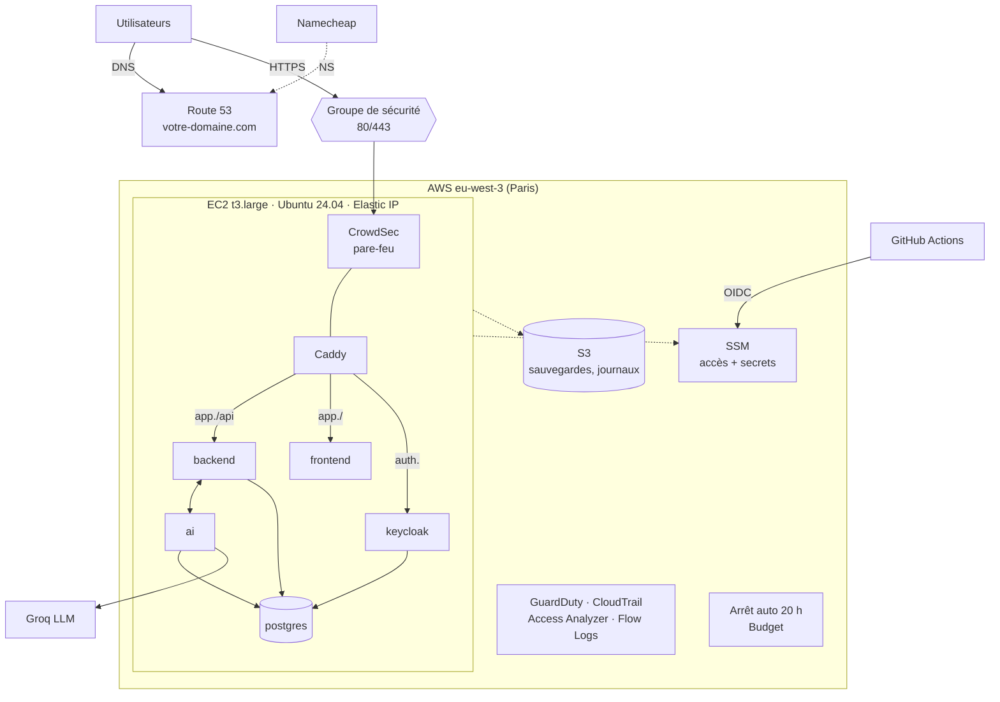
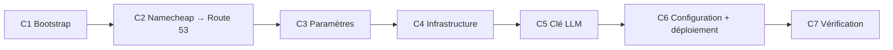

# LogiFlow : guide complet de déploiement et d'exploitation

Ce guide **unique** mène de zéro à LogiFlow en production sur AWS, puis couvre l'exploitation au
quotidien, la sécurité, la CI/CD et la fin de projet. Il se suit **dans l'ordre**. Chaque étape
indique le **résultat attendu** : ne passez à la suivante que s'il est obtenu.

Les documents du dossier [`docs/`](docs/) détaillent chaque sujet. Des liens y renvoient tout au
long du guide.

---

## Sommaire

- [Partie A : Comprendre](#partie-a--comprendre)
  - [A1. Ce qui est déployé](#a1-ce-qui-est-déployé)
  - [A2. Architecture](#a2-architecture)
  - [A3. Coûts](#a3-coûts)
- [Partie B : Préparer (une fois)](#partie-b--préparer-une-fois)
  - [B1. Compte AWS](#b1-compte-aws)
  - [B2. Poste de travail](#b2-poste-de-travail)
  - [B3. GitHub : dépôts et images](#b3-github--dépôts-et-images)
  - [B4. Clé du LLM](#b4-clé-du-llm)
  - [B5. Domaine Namecheap](#b5-domaine-namecheap)
- [Partie C : Déployer en production](#partie-c--déployer-en-production)
  - [C1. Bootstrap](#c1-bootstrap)
  - [C2. Déléguer le domaine à Route 53](#c2-déléguer-le-domaine-à-route-53)
  - [C3. Paramètres de l'environnement](#c3-paramètres-de-lenvironnement)
  - [C4. Créer l'infrastructure](#c4-créer-linfrastructure)
  - [C5. Clé du LLM](#c5-clé-du-llm)
  - [C6. Configurer le serveur et déployer](#c6-configurer-le-serveur-et-déployer)
  - [C7. Vérifier](#c7-vérifier)
- [Partie D : Automatiser (CI/CD)](#partie-d--automatiser-cicd)
- [Partie E : Sécuriser](#partie-e--sécuriser)
- [Partie F : Exploiter au quotidien](#partie-f--exploiter-au-quotidien)
- [Partie G : Mettre à jour, revenir en arrière](#partie-g--mettre-à-jour-revenir-en-arrière)
- [Partie H : Sauvegarder, restaurer](#partie-h--sauvegarder-restaurer)
- [Partie I : Surveiller et réagir](#partie-i--surveiller-et-réagir)
- [Partie J : Dépannage express](#partie-j--dépannage-express)
- [Partie K : Préparer une soutenance](#partie-k--préparer-une-soutenance)
- [Partie L : Fin de projet](#partie-l--fin-de-projet)
- [Annexes](#annexes)

---

## Partie A : Comprendre

### A1. Ce qui est déployé

| Composant | Technologie | Rôle |
|---|---|---|
| Interface | Angular 22, servi par nginx (non-root) | Application web |
| API | Spring Boot 4.1 (Spring Modulith), profil `prod` | Métier, sécurité JWT |
| Service IA | Flask + LLM Groq | Copilote, planification, maintenance prédictive |
| Identité | Keycloak 26 (OIDC, PKCE, MFA en option) | Connexion, 6 rôles métier |
| Base de données | PostgreSQL 18 + PostGIS + pgvector | 3 bases : `logiflow`, `logiflow_ai`, `keycloak` |
| Proxy | Caddy 2.8 | HTTPS automatique, HTTP/3, routage, en-têtes de sécurité |

Dépôts :

| Dépôt | Contenu |
|---|---|
| `logiflow-backend` | API, image PostgreSQL, image Keycloak |
| `logiflow-frontend` | Interface Angular |
| `logiflow-ai-service` | Service IA |
| `logiflow-infra` (ce dépôt) | Terraform, Ansible, stack Compose, CI/CD, documentation |

### A2. Architecture



**Principes clés :**

- **Un seul serveur** qui exécute toute la stack en conteneurs. C'est économique, et la stack est
  identique en local et en production.
- **Aucun port d'administration** : pas de SSH, tout passe par AWS SSM, authentifié par IAM et
  tracé.
- **Aucun secret dans Git** : Terraform les génère et les stocke dans SSM Parameter Store, et
  Ansible écrit le `.env` du serveur.
- **HTTPS automatique** sur votre domaine : `app.` pour l'application, `auth.` pour Keycloak, et
  la racine ainsi que `www` redirigent vers `app.`.
- **Sécurité en couches** : contrôles en CI, analyse avant publication, DAST, CrowdSec,
  GuardDuty (voir [Partie E](#partie-e--sécuriser)).

Détails : [docs/01-architecture.md](docs/01-architecture.md).

### A3. Coûts

| Usage | Coût mensuel estimé |
|---|---|
| Serveur arrêté (fixe : disque, IP, zone DNS, alarme) | ≈ 7,50 $ |
| À la demande (≈ 60 h/mois) | ≈ 14 $ |
| Jours ouvrés 8 h – 20 h | ≈ 34 $ |
| Allumé en permanence | ≈ 80 $ ⚠ |
| Services de sécurité (après 30 jours gratuits de GuardDuty) | + ≈ 1 $ |

Garde-fous : **arrêt automatique à 20 h**, **budget** avec alertes à 50, 80 et 100 %, et aucune
ressource coûteuse (pas de NAT, pas d'ALB, pas de RDS). Détails :
[docs/08-couts.md](docs/08-couts.md).

---

## Partie B : Préparer (une fois)

### B1. Compte AWS

1. Vérifiez les crédits dans *Billing → Credits*.
2. Créez un **utilisateur d'administration**, et n'utilisez **jamais root** :
   - méthode recommandée : *IAM Identity Center*, avec un utilisateur et le jeu d'autorisations
     `AdministratorAccess` ;
   - méthode simple : *IAM → Users*, avec la politique `AdministratorAccess` et une clé d'accès CLI.
3. Activez le **MFA** sur root et sur cet utilisateur.
4. Travaillez dans la région **`eu-west-3` (Paris)**.

### B2. Poste de travail

Les commandes s'exécutent sous **Linux, macOS ou WSL**. Sous Windows, dans PowerShell
administrateur :

```powershell
wsl --install -d Ubuntu-24.04
```

Puis, **dans le terminal Ubuntu** :

```bash
# Outils de base
sudo apt update && sudo apt install -y jq make git dnsutils pipx unzip

# Terraform
wget -O- https://apt.releases.hashicorp.com/gpg | sudo gpg --dearmor -o /usr/share/keyrings/hashicorp.gpg
echo "deb [signed-by=/usr/share/keyrings/hashicorp.gpg] https://apt.releases.hashicorp.com $(lsb_release -cs) main" \
  | sudo tee /etc/apt/sources.list.d/hashicorp.list
sudo apt update && sudo apt install -y terraform

# AWS CLI v2
sudo snap install aws-cli --classic

# Plugin Session Manager (obligatoire)
curl -fsSLo /tmp/ssm.deb https://s3.amazonaws.com/session-manager-downloads/plugin/latest/ubuntu_64bit/session-manager-plugin.deb
sudo dpkg -i /tmp/ssm.deb

# Ansible
pipx ensurepath && exec $SHELL
pipx install --include-deps ansible
pipx inject ansible boto3 botocore

# Authentification AWS
aws configure sso          # ou : aws configure (clé d'accès), région eu-west-3
export AWS_PROFILE=<profil>

# Dépôt : dans le système de fichiers Linux, PAS dans /mnt/c
git clone https://github.com/ibrahim-stitou/logiflow-infra.git ~/logiflow-infra
cd ~/logiflow-infra
make outils
```

**Attendu** : tous les outils à `ok`, puis l'ARN de votre utilisateur AWS.

### B3. GitHub : dépôts et images

Le serveur télécharge 5 images depuis GHCR, publiées par la CI de chaque dépôt à chaque push
sur `main` :

| Image | Dépôt |
|---|---|
| `ghcr.io/ibrahim-stitou/logiflow-backend` | logiflow-backend |
| `ghcr.io/ibrahim-stitou/logiflow-postgres` | logiflow-backend |
| `ghcr.io/ibrahim-stitou/logiflow-keycloak` | logiflow-backend |
| `ghcr.io/ibrahim-stitou/logiflow-ai-service` | logiflow-ai-service |
| `ghcr.io/ibrahim-stitou/logiflow-frontend` | logiflow-frontend |

1. Vérifiez que la CI de chaque dépôt est **verte** sur `main` et que les paquets existent (profil
   GitHub → *Packages*).
2. Rendez chaque paquet **public** : *Package settings → Change visibility → Public*. Sinon,
   enregistrez un jeton `read:packages` dans SSM après l'étape C4 :

   ```bash
   aws ssm put-parameter --name /logiflow/prod/secrets/ghcr-user  --type SecureString --value <utilisateur>
   aws ssm put-parameter --name /logiflow/prod/secrets/ghcr-token --type SecureString --value <jeton>
   ```

### B4. Clé du LLM

Créez une clé sur <https://console.groq.com/keys> (préfixe `gsk_`). Ne la mettez **jamais** dans
Git : elle ira uniquement dans SSM, à l'étape C5.

### B5. Domaine Namecheap

Le domaine reste enregistré chez Namecheap, mais son DNS sera géré par **Route 53**.

- [ ] Désactivez **DNSSEC** chez Namecheap (*Domain List → Manage → Advanced DNS*).
- [ ] Notez les éventuels enregistrements existants (redirection d'e-mails…) : ils devront être
  recréés dans Route 53.

---

## Partie C : Déployer en production



Comptez environ **1 heure**, propagation DNS comprise.

### C1. Bootstrap

Cette étape crée les ressources **durables**, qui survivent à la destruction de
l'environnement :

- le bucket de l'état Terraform ;
- les rôles GitHub OIDC ;
- la **zone Route 53** de votre domaine.

```bash
cp terraform/bootstrap/terraform.tfvars.example terraform/bootstrap/terraform.tfvars
nano terraform/bootstrap/terraform.tfvars      # domaine = "votre-domaine.com"
make bootstrap                                  # répondre « yes »
```

**Attendu** :

```
bucket_etat             = "logiflow-tfstate-123456789012"
role_github_deploiement = "arn:aws:iam::123456789012:role/logiflow-github-deploiement"
role_github_terraform   = "arn:aws:iam::123456789012:role/logiflow-github-terraform"
serveurs_de_noms        = ["ns-1234.awsdns-12.org", "ns-567.awsdns-34.net", "ns-89.awsdns-56.com", "ns-1890.awsdns-78.co.uk"]
```

Conservez `terraform/bootstrap/terraform.tfstate` et `terraform.tfvars` : ils ne sont pas
versionnés.

### C2. Déléguer le domaine à Route 53

Faites-le **tout de suite**, car la propagation se déroule pendant les étapes suivantes.

1. Chez Namecheap, ouvrez *Domain List*, puis **Manage** en face du domaine.
2. Dans l'onglet *Domain*, section **Nameservers**, choisissez **Custom DNS**.
3. Saisissez les **4 serveurs** de `serveurs_de_noms`, sans point final, puis validez avec la
   coche verte.
4. Vérifiez (à relancer jusqu'à voir `awsdns`) :

   ```bash
   make dns
   ```

La délégation se fait **une seule fois** : la zone vit dans le bootstrap, et ses serveurs de
noms ne changent plus.

### C3. Paramètres de l'environnement

```bash
cd terraform/environments/prod
cp backend.hcl.example backend.hcl                 # remplacer <ID_COMPTE_AWS> (sortie bucket_etat)
cp terraform.tfvars.example terraform.tfvars
nano terraform.tfvars
cd -
make init
```

Dans `terraform.tfvars`, renseignez au minimum :

```hcl
email_alertes = "vous@exemple.com"        # alertes budget ET sécurité
domaine       = "votre-domaine.com"       # identique au bootstrap
```

Variables utiles :

| Variable | Défaut | Rôle |
|---|---|---|
| `type_instance` | `t3.large` | 8 Go de mémoire |
| `budget_mensuel_usd` | `30` | Seuil des alertes de budget |
| `donnees_demo` | `true` | Jeu de démonstration et 6 comptes (un par rôle) |
| `mfa_obligatoire` | `false` | OTP exigé par le backend |
| `arret_automatique` | `true` | Arrêt à 20 h |
| `demarrage_automatique` | `false` | Démarrage à 8 h du lundi au vendredi |
| `activer_guardduty` | `true` | Détection de menaces AWS |

**Attendu** : `Terraform has been successfully initialized!`.

### C4. Créer l'infrastructure

```bash
make plan     # facultatif : environ 60 ressources
make apply    # répondre « yes » (≈ 3 min)
```

**Attendu** :

```
url_application     = "https://app.votre-domaine.com"
url_keycloak        = "https://auth.votre-domaine.com"
enregistrements_dns = ["votre-domaine.com", "www.votre-domaine.com", "app.votre-domaine.com", "auth.votre-domaine.com"]
bucket_journaux     = "logiflow-prod-journaux-123456789012"
```

À faire maintenant :

- [ ] **Confirmez l'abonnement** dans l'e-mail « AWS Notification - Subscription Confirmation »,
  sinon vous ne recevrez aucune alerte de sécurité.
- [ ] Attendez 2 à 3 minutes que l'agent SSM du serveur s'enregistre.
- [ ] Vérifiez le DNS : `dig +short app.votre-domaine.com @8.8.8.8` doit renvoyer `ip_publique`.

### C5. Clé du LLM

```bash
 make secret-llm CLE=gsk_votre_cle     # l'espace initiale évite l'historique du shell
```

### C6. Configurer le serveur et déployer

```bash
make configure     # ≈ 10 à 15 min au premier passage
```

Ansible se connecte **par SSM** et exécute les rôles suivants :

| Rôle | Actions |
|---|---|
| `base` | Paquets, mises à jour de sécurité automatiques, fuseau horaire, swap, désactivation de SSH |
| `docker` | Docker Engine et Compose, démon durci (`no-new-privileges`, IP réelles) |
| `securite` | Noyau durci, auditd, Lynis, **CrowdSec** et son bouncer pare-feu |
| `logiflow` | Secrets lus dans SSM, `.env` (600), stack, redirection du domaine, puis `deployer.sh` (images, démarrage, Keycloak, santé HTTPS) |
| `sauvegardes` | Sauvegarde quotidienne à 19 h 45 vers S3 |

**Attendu** (fin du journal) :

```
[...] OK : https://app.votre-domaine.com répond
PLAY RECAP
i-0abc... : ok=70 changed=50 unreachable=0 failed=0
```

### C7. Vérifier

```bash
make identifiants
make etat
make securite
```

Parcours :

1. Ouvrez `https://app.votre-domaine.com` : la page de connexion LogiFlow (Keycloak) s'affiche.
2. Connectez-vous avec `admin` et le mot de passe de démo affiché par `make identifiants`.
3. Ouvrez les modules Flotte, Dossiers et Maintenance : les données de démonstration sont
   présentes.
4. Posez une question au **copilote** : la réponse arrive en flux continu.
5. Ouvrez `https://votre-domaine.com` : vous êtes redirigé vers `app.`.
6. Changez le mot de passe `admin` de Keycloak (`https://auth.votre-domaine.com/admin`).

🎉 **LogiFlow est en production.**

---

## Partie D : Automatiser (CI/CD)

### D1. Workflows

| Dépôt | Workflow | Déclencheur | Effet |
|---|---|---|---|
| Applicatifs | **CI** | push, PR | Lint, tests, build, **analyse Trivy de l'image**, publication GHCR (sur `main`) avec SBOM et provenance |
| Tous | **Sécurité** | push, PR, lundi, manuel | Gitleaks, CodeQL, Trivy → onglet *Security* |
| logiflow-infra | **Qualité** | push, PR | terraform fmt/validate/tflint, ansible-lint, shellcheck, Compose, Caddy |
| logiflow-infra | **Terraform** | PR (`plan` commenté), manuel (`apply` approuvé) | Infrastructure |
| logiflow-infra | **Déployer** | manuel, `repository_dispatch` | Démarre le serveur si besoin, puis `deployer.sh` par SSM |
| logiflow-infra | **DAST (OWASP ZAP)** | après un déploiement, manuel | Scan de l'application en ligne |

GitHub Actions n'a **aucune clé AWS** : il obtient des identifiants temporaires par **OIDC**,
limités au dépôt, à `main` et à l'environnement `production`.

### D2. Configuration (une fois)

Dans `logiflow-infra` sur GitHub :

1. *Settings → Environments → New environment* `production`, avec **Required reviewers**
   (vous) et *Deployment branches* limitées à `main`.
2. *Settings → Secrets and variables → Actions → **Variables*** :

| Variable | Valeur |
|---|---|
| `AWS_ROLE_TERRAFORM` | sortie `role_github_terraform` du bootstrap |
| `AWS_ROLE_DEPLOIEMENT` | sortie `role_github_deploiement` |
| `TF_STATE_BUCKET` | sortie `bucket_etat` |
| `EMAIL_ALERTES` | votre adresse |
| `DOMAINE` | `votre-domaine.com` |

3. *Settings → Branches* : protégez `main` (PR obligatoire, workflows **Qualité** et **Sécurité**
   requis).
4. Test : *Actions → Déployer → Run workflow*, puis approuver. Le workflow DAST s'enchaîne.

> **Valeurs Terraform en CI** : `terraform.tfvars` n'est pas versionné, donc la CI utilise les
> **valeurs par défaut** de `variables.tf`, plus `EMAIL_ALERTES` et `DOMAINE`. Pour un réglage
> durable, modifiez la valeur par défaut dans `variables.tf` par une PR.

### D3. Flux de travail

| Je veux… | Je fais… |
|---|---|
| Livrer une évolution applicative | PR → CI verte → fusion dans `main` → *Actions → Déployer* |
| Modifier l'infrastructure | PR (plan commenté) → relecture → fusion → *Actions → Terraform → apply* |
| Modifier la stack ou Ansible | PR → *Qualité* verte → fusion → `make configure-app` |
| Déployer automatiquement à chaque push | Voir [docs/06-ci-cd.md § 6.6](docs/06-ci-cd.md#66-déploiement-automatique-depuis-un-dépôt-applicatif-facultatif) |

---

## Partie E : Sécuriser

### E1. Vue d'ensemble

| Couche | Outils | Bloquant ? |
|---|---|---|
| Code | Gitleaks (secrets), CodeQL (SAST), Trivy (dépendances), Dependabot | Secrets, et CVE CRITIQUES corrigeables |
| IaC | Trivy config | Mauvaise configuration CRITIQUE |
| Build | Trivy image **avant publication**, SBOM et provenance | Image vulnérable **jamais publiée** |
| Déploiement | OWASP ZAP (DAST) | En-têtes de sécurité essentiels |
| Serveur | CrowdSec, auditd, Lynis, noyau et conteneurs durcis | Blocage automatique des IP |
| AWS | GuardDuty, Access Analyzer, CloudTrail, VPC Flow Logs, alertes e-mail | — |

### E2. Activer les protections GitHub (une fois)

Pour chacun des 4 dépôts : *Settings → Code security* → **Dependabot alerts**, **Dependabot
security updates**, **Secret scanning**, **Push protection**. Ou en une commande :

```bash
for r in logiflow-backend logiflow-frontend logiflow-ai-service logiflow-infra; do
  gh api -X PATCH repos/ibrahim-stitou/$r --input - <<'JSON'
{"security_and_analysis":{"secret_scanning":{"status":"enabled"},"secret_scanning_push_protection":{"status":"enabled"}}}
JSON
  gh api -X PUT repos/ibrahim-stitou/$r/vulnerability-alerts
  gh api -X PUT repos/ibrahim-stitou/$r/automated-security-fixes
done
```

### E3. Commandes de sécurité

```bash
make securite                  # CrowdSec : IP bloquées, dernières attaques
make debloquer IP=1.2.3.4      # lever un blocage (faux positif)
make audit                     # Lynis : indice de durcissement
make journal-audit             # auditd : accès aux secrets du jour
make alertes-securite          # GuardDuty : découvertes actives
```

### E4. Traiter une vulnérabilité

1. Lisez l'alerte : paquet, version, version corrigée.
2. Corrigez : montez la version, ou fusionnez la PR Dependabot. Pour une dépendance gérée par
   Spring Boot, surchargez la propriété de version dans `pom.xml` (exemple réel :
   `<tomcat.version>`).
3. En dernier recours, et seulement si la vulnérabilité n'est pas exploitable, ajoutez-la dans
   `.trivyignore` avec une justification et une date de revue.

Détails : [docs/10-outils-securite.md](docs/10-outils-securite.md). Référence complète (modèle de
menaces, fiches, **scénarios de démonstration**) :
[docs/11-securite-reference.md](docs/11-securite-reference.md).

---

## Partie F : Exploiter au quotidien

| Besoin | Commande |
|---|---|
| Allumer le serveur (≈ 3 min) | `make demarrer` |
| Éteindre (sinon à 20 h) | `make arreter` |
| L'instance tourne-t-elle ? | `make statut` |
| Santé de l'application | `make etat` |
| Journaux d'un service | `make journaux SERVICE=backend` (`ai`, `keycloak`, `caddy`, `frontend`, `postgres`) |
| Terminal sur le serveur | `make console` |
| URL et mots de passe | `make identifiants` |
| DNS | `make dns` |
| Toutes les commandes | `make aide` |

**Horaires** : modifiez `cron_arret`, `arret_automatique` et `demarrage_automatique`, puis
`make apply`.

**Comptes utilisateurs** (console `https://auth.votre-domaine.com/admin`, realm `logiflow`) :

1. *Users → Add user*.
2. *Credentials → Set password*.
3. *Role mapping → Assign role* : `ADMINISTRATEUR`, `RESPONSABLE_EXPLOITATION`, `EXPLOITANT`,
   `COMMERCIAL`, `ATELIER` ou `CHAUFFEUR`.

**Secrets** : tous dans SSM, sous `/logiflow/prod/secrets/`. Pour changer la clé LLM :
`make secret-llm CLE=…`, puis `make configure-app`.

Détails : [docs/05-exploitation.md](docs/05-exploitation.md).

---

## Partie G : Mettre à jour, revenir en arrière

| Changement | Commande |
|---|---|
| Nouvelles images (après fusion dans `main`) | `make deployer` (ou workflow *Déployer*) |
| Fichiers de `stack/`, secret, configuration SSM | `make configure-app` |
| Rôles Ansible (système, sécurité) | `make configure` |
| Terraform | `make apply` |

**Revenir à une version précédente** : chaque image est aussi publiée avec le **SHA du commit**.

```bash
make configure-app TAG_BACKEND=<sha>                       # backend, keycloak et postgres
make configure-app TAG_FRONTEND=<sha> TAG_AI=<sha>
make configure-app                                          # retour aux dernières versions
```

> Revenir en arrière sur le code ne défait pas une migration de base : restaurez alors la
> sauvegarde précédente ([Partie H](#partie-h--sauvegarder-restaurer)).

---

## Partie H : Sauvegarder, restaurer

| | |
|---|---|
| Contenu | Bases `logiflow`, `logiflow_ai`, `keycloak` + pièces jointes |
| Fréquence | Tous les jours à 19 h 45 (serveur allumé) |
| Emplacement | Serveur (7 dernières) + S3 **versionné** (14 jours) |

```bash
make sauvegarder        # maintenant
make sauvegardes        # lister
```

**Restaurer** (remplace les données actuelles) :

```bash
make console
sudo /opt/logiflow/bin/restaurer.sh --liste
sudo /opt/logiflow/bin/restaurer.sh logiflow-20260925T174500Z.tar    # taper « restaurer »
```

> Testez une restauration au moins une fois : une sauvegarde jamais restaurée n'est pas une
> sauvegarde.

---

## Partie I : Surveiller et réagir

| Source | Canal |
|---|---|
| Budget AWS (50, 80, 100 %) | E-mail |
| GuardDuty (sévérité ≥ 4), Access Analyzer | E-mail (après confirmation de l'abonnement SNS) |
| Vulnérabilités, secrets, SAST | Onglet *Security* des dépôts, PR Dependabot |
| Attaques web | `make securite` |
| Santé | `make etat`, alarme de récupération automatique de l'instance |

**Réactions types :**

| Alerte | Réaction |
|---|---|
| Secret exposé | **Révoquer et régénérer d'abord**, nettoyer le dépôt ensuite |
| CVE CRITIQUE | Monter la version, redéployer |
| GuardDuty `Recon:` | Bruit habituel d'Internet, rien à faire |
| GuardDuty `InstanceCredentialExfiltration` | `make arreter`, révoquer les sessions du rôle `logiflow-prod-serveur`, analyser CloudTrail, reconstruire |
| GuardDuty `CryptoCurrency:` / `Backdoor:` | Serveur compromis : arrêt, snapshot pour analyse, reconstruction, **tous** les secrets régénérés, restauration |
| Budget dépassé | `make statut` : instance oubliée ? Arrêt automatique actif ? |

Détails : [docs/10-outils-securite.md § 10.5](docs/10-outils-securite.md#105-réagir-à-une-alerte).

---

## Partie J : Dépannage express

| Symptôme | Correction |
|---|---|
| Site injoignable | `make statut` puis `make demarrer` (arrêt de 20 h ?) |
| Site injoignable **pour vous seul** | IP bloquée par CrowdSec : `make securite`, puis `make debloquer IP=…` |
| Erreur de certificat | DNS pas encore propagé (`make dns`) ; attendre, puis `make deployer` |
| `502 Bad Gateway` | Démarrage en cours (1 à 2 min), sinon `make etat` et `make journaux` |
| Boucle de redirection à la connexion | `make configure-app` (réaligne le client Keycloak) |
| API en `401` | Émetteur du jeton : `make configure-app` ; MFA activé : configurer l'OTP |
| Copilote muet | Clé LLM : `make secret-llm CLE=…`, puis `make configure-app` |
| Ansible ne trouve pas l'hôte | Serveur arrêté, ou agent SSM pas prêt (attendre 2 min) |
| `docker pull` refusé | Paquets GHCR privés : les rendre publics, ou jeton dans SSM (B3) |
| CI rouge sur Trivy | CVE CRITIQUE : monter la version (E4) |
| `detector already exists` | `activer_guardduty = false` |
| Pas d'alerte de sécurité | Confirmer l'abonnement SNS (e-mail d'AWS) |

Diagnostic complet : [docs/09-depannage.md](docs/09-depannage.md). Reconstruction totale en
environ 20 min : [§ 9.7](docs/09-depannage.md#97-tout-reconstruire).

---

## Partie K : Préparer une soutenance

**La veille :**

- [ ] `arret_automatique = false` (ou `demarrage_automatique = true`), puis `make apply`.
- [ ] `make demarrer`, `make etat` et `make securite`.
- [ ] `make sauvegarder`.
- [ ] CI et *Sécurité* verts sur les 4 dépôts ; onglet *Security* sans alerte critique ouverte.
- [ ] Lancer le workflow DAST et conserver le rapport ZAP.
- [ ] `make audit` : noter l'indice Lynis.
- [ ] Vérifier la note A sur <https://www.ssllabs.com/ssltest/> et <https://securityheaders.com>.
- [ ] Préparer les **preuves** listées dans [docs/11 § 11.8](docs/11-securite-reference.md#118-preuves-à-collecter).
- [ ] Ne jamais projeter `make identifiants` : les secrets s'y affichent en clair.

**Démonstrations possibles** (scénarios détaillés dans [docs/11 § 11.7](docs/11-securite-reference.md#117-scénarios-de-démonstration)) :

1. Déploiement en un clic : *Actions → Déployer*, puis ZAP enchaîné.
2. Secret détecté par Gitleaks.
3. PR bloquée par une dépendance vulnérable.
4. Attaque bloquée par CrowdSec.
5. Alerte GuardDuty reçue par e-mail.
6. Accès aux secrets tracé par auditd.

**Après** : remettez `arret_automatique = true`, puis `make apply`.

---

## Partie L : Fin de projet

```bash
make sauvegarder
aws s3 cp s3://$(terraform -chdir=terraform/environments/prod output -raw bucket_sauvegardes)/sauvegardes/<dernière>.tar .
make detruire                      # taper « detruire » : serveur, données, buckets, sécurité…
```

Restent les ressources du **bootstrap** : la zone DNS (0,50 $/mois), le bucket d'état et les
rôles. Pour tout supprimer :

```bash
terraform -chdir=terraform/bootstrap state rm 'aws_route53_zone.principale[0]' 'aws_route53_record.caa[0]'
aws s3 rm s3://logiflow-tfstate-<compte> --recursive      # puis « Empty » dans la console (versions)
terraform -chdir=terraform/bootstrap destroy
# Route 53 : supprimer l'enregistrement CAA, puis la zone ; Namecheap : repasser en « Namecheap BasicDNS »
```

Enfin, supprimez la clé d'accès de votre utilisateur IAM, si vous en avez créé une.

---

## Annexes

### Annexe 1 : commandes `make`

| Catégorie | Commandes |
|---|---|
| Mise en place | `outils`, `bootstrap`, `dns`, `init`, `plan`, `apply`, `sortie`, `secret-llm CLE=` |
| Déploiement | `configure`, `configure-app` (`TAG_BACKEND=`, `TAG_AI=`, `TAG_FRONTEND=`), `deployer` |
| Exploitation | `demarrer`, `arreter`, `statut`, `etat`, `journaux SERVICE=`, `console`, `identifiants` |
| Sauvegardes | `sauvegarder`, `sauvegardes`, `restaurer` |
| Sécurité | `securite`, `debloquer IP=`, `audit`, `journal-audit [CLE=]`, `alertes-securite` |
| Local | `local-up`, `local-journaux SERVICE=`, `local-down [ARGS=-v]` |
| Qualité / fin | `valider`, `detruire` |

### Annexe 2 : arborescence

```
logiflow-infra/
├── GUIDE-COMPLET.md            ce guide
├── README.md                   présentation et démarrage rapide
├── Makefile                    toutes les opérations
├── docs/                       documentation détaillée (01 à 11) et ADR
├── stack/                      ce qui tourne sur le serveur (compose, Caddyfile, Keycloak, scripts)
├── terraform/
│   ├── bootstrap/              état, rôles GitHub OIDC, zone Route 53
│   ├── modules/                reseau, serveur, dns, secrets, sauvegardes, couts, securite
│   └── environments/prod/      assemblage de la production
├── ansible/                    rôles base, docker, securite, logiflow, sauvegardes
├── scripts/ssm-exec.sh         exécution de commandes par SSM
├── .github/workflows/          qualite, securite, terraform, deployer, dast
├── .zap/rules.tsv              règles du scan DAST
└── .trivyignore                exceptions Trivy justifiées
```

### Annexe 3 : sur le serveur

```
/opt/logiflow/
├── compose.yaml, Caddyfile, .env (600, généré)
├── caddy-sites/redirection.caddy      racine et www → app.
├── keycloak/, postgres/init/
└── bin/  deployer.sh  sauvegarder.sh  restaurer.sh  etat.sh  securite.sh
/var/backups/logiflow/                 sauvegardes locales
/etc/crowdsec/                         configuration CrowdSec
/etc/audit/rules.d/50-logiflow.rules   règles auditd
/var/log/lynis-report.dat              dernier audit Lynis
```

### Annexe 4 : paramètres SSM (`/logiflow/prod/`)

| Paramètre | Origine |
|---|---|
| `secrets/db-password`, `ai-db-password`, `keycloak-db-password` | Générés par Terraform |
| `secrets/keycloak-admin-password`, `demo-users-password` | Générés par Terraform |
| `secrets/ai-internal-api-key`, `ai-callback-api-key` | Générés par Terraform |
| `secrets/llm-api-key` | `make secret-llm` |
| `secrets/ghcr-user`, `ghcr-token` | Facultatifs |
| `config/app-domain`, `auth-domain`, `domaine-racine`, `bucket-sauvegardes`, `demo-data`, `mfa-required` | Terraform |

### Annexe 5 : documentation détaillée

| Document | Contenu |
|---|---|
| [01 Architecture](docs/01-architecture.md) | Composants, flux, choix |
| [02 Prérequis](docs/02-prerequis.md) | Compte, outils, GitHub, LLM, domaine |
| [03 Tester en local](docs/03-tester-en-local.md) | Stack de production sur le poste |
| [04 Premier déploiement](docs/04-premier-deploiement.md) | Pas à pas détaillé |
| [05 Exploitation](docs/05-exploitation.md) | Opérations courantes |
| [06 CI/CD](docs/06-ci-cd.md) | Workflows, OIDC, déploiement automatique |
| [07 Sécurité](docs/07-securite.md) | Surface, secrets, identités, écarts assumés |
| [08 Coûts](docs/08-couts.md) | Estimation, garde-fous |
| [09 Dépannage](docs/09-depannage.md) | Symptômes et corrections |
| [10 Outils de sécurité](docs/10-outils-securite.md) | Chaîne DevSecOps |
| [11 Sécurité : référence](docs/11-securite-reference.md) | Menaces, fiches outils, démonstrations, preuves |
| [ADR](docs/adr/) | Décisions d'architecture (0001 à 0005) |
