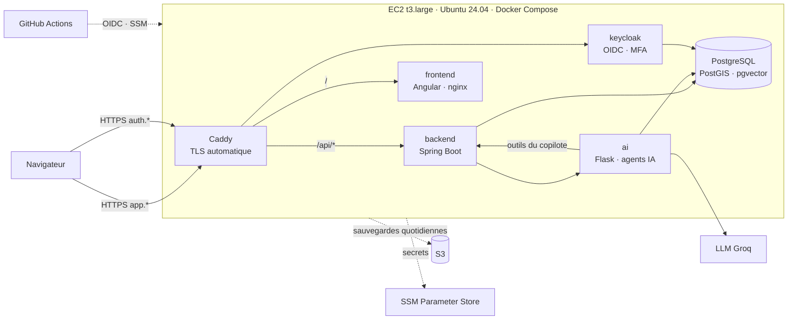

# LogiFlow Infra

Infrastructure et déploiement de production du TMS **LogiFlow** sur **AWS** : Terraform
(provisionnement), Ansible (configuration), Docker Compose (exécution) et GitHub Actions
(CI/CD).



| Élément | Choix |
|---|---|
| Hébergement | **1 instance EC2** (`eu-west-3`, Paris) qui exécute toute la stack en conteneurs |
| Accès public | **HTTPS uniquement** (Caddy + Let's Encrypt), domaines gratuits **sslip.io** ou votre domaine |
| Administration | **AWS SSM** : aucun port SSH ouvert, aucune clé SSH |
| Secrets | **SSM Parameter Store**, générés par Terraform, chiffrés, jamais dans Git |
| Identité | **Keycloak** (OIDC, PKCE, MFA en option) |
| Sauvegardes | Quotidiennes (3 bases + pièces jointes) vers **S3**, 14 jours de rétention |
| Coûts | **Arrêt automatique chaque soir**, alertes de budget : environ 12 à 30 $/mois selon l'usage ([détail](docs/08-couts.md)) |
| CI/CD | Contrôles qualité et sécurité, `plan` Terraform sur les PR, `apply` et déploiement **en un clic** (OIDC, sans clé AWS dans GitHub) |

---

## Démarrage rapide

> Première fois ? Suivez le guide pas à pas : **[docs/04-premier-deploiement.md](docs/04-premier-deploiement.md)**
> (compter environ 45 minutes, dont 15 d'attente).

Depuis WSL, Linux ou macOS, avec les [prérequis](docs/02-prerequis.md) installés :

```bash
make outils                     # vérifie terraform, aws, ansible, plugin SSM, jq
make bootstrap                  # une seule fois : état Terraform distant + rôles GitHub
cp terraform/environments/prod/backend.hcl.example terraform/environments/prod/backend.hcl
cp terraform/environments/prod/terraform.tfvars.example terraform/environments/prod/terraform.tfvars
make init                       # Terraform + collections Ansible
make apply                      # crée l'infrastructure AWS (≈ 3 min)
make secret-llm CLE=gsk_...     # clé du fournisseur LLM (Groq)
make configure                  # configure le serveur et déploie LogiFlow (≈ 10 min)
make identifiants               # URL, admin Keycloak, comptes de démonstration
```

Au quotidien :

```bash
make demarrer        # allume le serveur (l'application redémarre seule)
make etat            # services, santé, ressources, dernière sauvegarde
make deployer        # met à jour l'application (nouvelles images)
make arreter         # éteint le serveur (sinon arrêt automatique à 20 h)
make aide            # toutes les commandes
```

---

## Documentation

| # | Document | Contenu |
|---|---|---|
| 1 | [Architecture](docs/01-architecture.md) | Composants, flux réseau, choix techniques et leurs raisons |
| 2 | [Prérequis](docs/02-prerequis.md) | Compte AWS, outils du poste (WSL), GitHub, clé LLM |
| 3 | [Tester en local](docs/03-tester-en-local.md) | La stack de production sur votre machine, avant AWS |
| 4 | [Premier déploiement](docs/04-premier-deploiement.md) | **Guide pas à pas**, du compte AWS vide à l'application en ligne |
| 5 | [Exploitation](docs/05-exploitation.md) | Démarrer, arrêter, mettre à jour, revenir en arrière, sauvegarder, restaurer, gérer les comptes |
| 6 | [CI/CD](docs/06-ci-cd.md) | Workflows GitHub, OIDC, déploiement automatique depuis les dépôts applicatifs |
| 7 | [Sécurité](docs/07-securite.md) | Surface exposée, secrets, identités, durcissement, écarts assumés |
| 8 | [Coûts](docs/08-couts.md) | Estimation, budget, économies, fin de projet |
| 9 | [Dépannage](docs/09-depannage.md) | Symptômes, diagnostics et corrections |
| — | [Décisions (ADR)](docs/adr/) | Décisions d'architecture de l'infrastructure |

## Structure du dépôt

```
stack/                      ce qui tourne sur le serveur (et en local)
  compose.yaml                les 7 services et leurs limites mémoire
  Caddyfile                   reverse proxy, TLS, routage /api et SSE
  .env.example                toutes les variables de la stack
  keycloak/                   realm « logiflow » paramétré + initialisation (comptes de démo)
  postgres/init/              création des bases logiflow_ai et keycloak
  scripts/                    deployer, sauvegarder, restaurer, etat (→ /opt/logiflow/bin)
terraform/
  bootstrap/                  état distant S3 + rôles GitHub OIDC (une seule fois)
  modules/                    reseau, serveur, secrets, sauvegardes, couts
  environments/prod/          assemblage de l'environnement de production
ansible/
  site.yml / deployer.yml     configuration complète / redéploiement applicatif
  roles/                      base, docker, logiflow, sauvegardes
  inventory/                  inventaire dynamique EC2 + variables (images, horaires)
scripts/ssm-exec.sh         exécute une commande sur le serveur via SSM
.github/workflows/          qualite, terraform, deployer
Makefile                    point d'entrée de toutes les opérations
```

## Dépôts applicatifs

| Dépôt | Image publiée par sa CI |
|---|---|
| [logiflow-backend](https://github.com/ibrahim-stitou/logiflow-backend) | `logiflow-backend`, `logiflow-postgres`, `logiflow-keycloak` |
| [logiflow-ai-service](https://github.com/ibrahim-stitou/logiflow-ai-service) | `logiflow-ai-service` |
| [logiflow-frontend](https://github.com/OussamaZouaine/logiflow-frontend) | `logiflow-frontend` |
