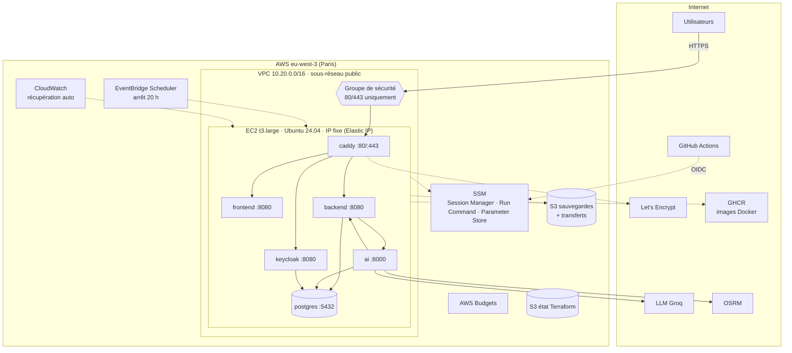
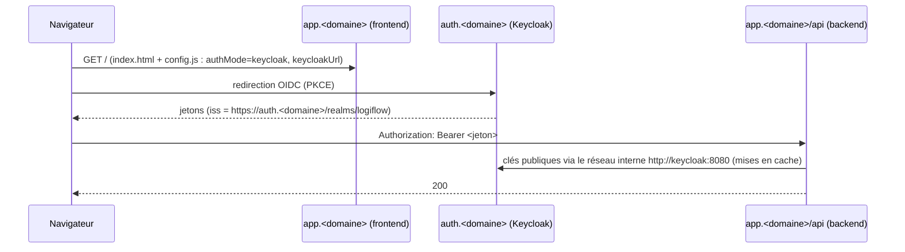
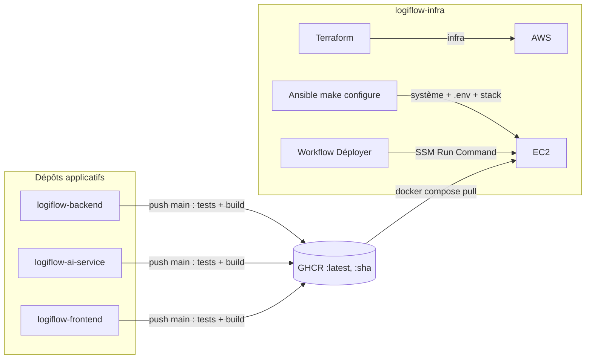

# 1. Architecture

## 1.1 Vue d'ensemble

## 1.2 Composants de la stack

| Service | Image | Rôle | Exposé | Mémoire max |
|---|---|---|---|---|
| `caddy` | `caddy:2.8-alpine` | Reverse proxy, TLS automatique, HTTP/2 et HTTP/3, en-têtes de sécurité | **80, 443** | 128 Mo |
| `frontend` | `logiflow-frontend` | Angular servi par nginx non-root ; `config.js` généré au démarrage | non | 64 Mo |
| `backend` | `logiflow-backend` | API Spring Boot, profil `prod` (JWT obligatoire) | non | 1,5 Go |
| `ai` | `logiflow-ai-service` | Agents IA (Flask, gunicorn) ; migrations Alembic au démarrage | non | 768 Mo |
| `keycloak` | `logiflow-keycloak` | OIDC : build optimisé, thème LogiFlow, realm importé | non | 1 Go |
| `keycloak-init` | idem | Tâche ponctuelle : comptes de démonstration (idempotente) | non | — |
| `postgres` | `logiflow-postgres` | PostgreSQL 18 avec PostGIS et pgvector ; 3 bases | non | 1 Go |

Total plafonné à environ 4,5 Go sur les 8 Go de la `t3.large`, avec 2 Go de swap en sécurité.

### Routage (Caddy)

| URL | Destination | Remarque |
|---|---|---|
| `https://app.<domaine>/api/*` | backend | `flush_interval -1` : le streaming SSE du copilote n'est pas mis en tampon |
| `https://app.<domaine>/v3/api-docs`, `/swagger-ui*` | backend | Documentation de l'API (désactivable : `API_DOCS_ENABLED=false`) |
| `https://app.<domaine>/actuator/health` | backend | Santé, utilisée par le script de déploiement |
| `https://app.<domaine>/*` | frontend | Application Angular |
| `https://auth.<domaine>/*` | keycloak | Connexion OIDC et console `/admin` ; `/metrics` et `/health` bloqués |
| `http://…` | — | Redirection automatique vers HTTPS |

L'interface et l'API partagent **la même origine** (`app.<domaine>`) : le navigateur n'a pas de
CORS à gérer.

### Flux d'authentification

Le backend vérifie que l'`iss` du jeton est égal à l'URL **publique** de Keycloak, et lit les
clés de signature par le **réseau interne** Docker. Il n'y a donc aucun aller-retour par
Internet.

### Données

| Donnée | Emplacement | Sauvegarde |
|---|---|---|
| Base `logiflow` (métier) | volume `postgres-data` | quotidienne, S3 |
| Base `logiflow_ai` (conversations du copilote) | volume `postgres-data` | quotidienne, S3 |
| Base `keycloak` (comptes, sessions) | volume `postgres-data` | quotidienne, S3 |
| Pièces jointes (documents) | volume `backend-uploads` | quotidienne, S3 |
| Certificats TLS | volume `caddy-data` | non (réémis automatiquement) |
| Secrets | SSM Parameter Store | gérés par Terraform |

## 1.3 Infrastructure AWS (Terraform)

| Module | Ressources |
|---|---|
| `bootstrap` | Bucket S3 de l'état (versionné, chiffré, verrou natif), fournisseur OIDC GitHub, rôles `logiflow-github-terraform` et `logiflow-github-deploiement` |
| `reseau` | VPC, sous-réseau public, passerelle Internet, groupe de sécurité par défaut verrouillé |
| `serveur` | EC2 (IMDSv2, disque chiffré), Elastic IP, groupe de sécurité 80/443, rôle IAM (SSM, lecture de ses paramètres, S3 des sauvegardes), alarme de récupération automatique |
| `secrets` | Paramètres SSM : secrets générés (`/logiflow/prod/secrets/*`) et configuration (`/logiflow/prod/config/*`) |
| `sauvegardes` | Buckets S3 `sauvegardes` (14 jours) et `transferts` (1 jour, connecteur Ansible) |
| `couts` | Budget mensuel avec alertes, arrêt planifié chaque soir, démarrage planifié en option |

## 1.4 Chaîne de déploiement

1. Chaque dépôt applicatif publie ses images sur GHCR à chaque push sur `main` : `latest` et le
   SHA du commit.
2. **Terraform** crée ou modifie l'infrastructure : `make apply`, ou le workflow `Terraform`.
3. **Ansible** configure le système et écrit `.env` à partir de SSM (`make configure`). Il ne
   faut le relancer qu'après un changement de configuration ou de secrets.
4. **Mise à jour applicative** : `make deployer`, ou le workflow `Déployer`, lance
   `deployer.sh`, qui récupère les images, redémarre et vérifie la santé.

## 1.5 Choix et alternatives écartées

| Choix | Pourquoi | Alternative écartée |
|---|---|---|
| **Une seule EC2 + Docker Compose** | Coût (budget de 70 $), simplicité d'exploitation, stack identique en local et en prod | 3 EC2 privées + NAT (≥ 35 $/mois pour la NAT seule), ECS/EKS (complexité et coût disproportionnés pour un projet d'étude) |
| **Sous-réseau public sans NAT** | Seuls 80/443 sont ouverts ; administration par SSM | Sous-réseau privé + passerelle NAT : même sécurité applicative, pour 35 $/mois de plus |
| **Caddy** | TLS automatique sans configuration, HTTP/3, configuration courte | nginx + certbot (plus de pièces mobiles), ALB (≈ 20 $/mois) |
| **sslip.io** | HTTPS valide sans acheter de domaine | Route 53 + domaine (≈ 12 $/an + 0,50 $/mois), toujours possible via la variable `domaine` |
| **SSM Parameter Store** | Gratuit (niveau standard), chiffré par KMS | Secrets Manager (0,40 $/secret/mois) |
| **SSM Session Manager** | Aucun port d'administration exposé, accès tracé par IAM | SSH + bastion, clés à gérer |
| **Arrêt programmé** | Plus de 60 % d'économie sur le calcul | Instance allumée en permanence (≈ 80 $/mois) |
| **Keycloak dans la stack** | Un seul serveur, image optimisée | Cognito (autre modèle de rôles, adaptation du backend) |

Voir aussi les [ADR de l'infrastructure](adr/).

## 1.6 Limites connues

- **Un seul serveur, donc pas de haute disponibilité.** Une panne matérielle est récupérée
  automatiquement (alarme CloudWatch) ; une panne de zone ne l'est pas.
- **Arrêt nocturne** : l'application est indisponible hors des heures d'allumage (voulu, pour
  économiser les crédits).
- **Dépendance à sslip.io** pour les domaines gratuits : en cas d'indisponibilité, basculer sur un
  vrai domaine (variable `domaine`).
- **Images `latest`** par défaut : pour figer une version, utiliser `TAG_BACKEND=<sha>`, `TAG_AI` ou `TAG_FRONTEND` (voir
  [Exploitation](05-exploitation.md#revenir-à-une-version-précédente)).
