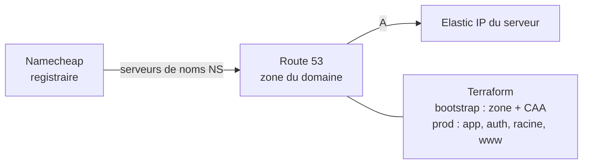

# 2. Prérequis

Liste à cocher **une seule fois**, avant le [premier déploiement](04-premier-deploiement.md).

## 2.1 Compte AWS

- [ ] Un compte AWS avec les crédits (70 $) appliqués : *Billing → Credits*.
- [ ] **Ne pas travailler avec l'utilisateur root.** Créer un utilisateur d'administration :
  - la méthode recommandée est *IAM Identity Center* : un utilisateur avec le jeu d'autorisations
    `AdministratorAccess`, puis connexion par `aws configure sso` ;
  - la méthode simple est *IAM → Users → Create user*, avec la politique `AdministratorAccess` et
    une clé d'accès de type « CLI ». Supprimez cette clé à la fin du projet.
- [ ] MFA activé sur le root **et** sur l'utilisateur d'administration.
- [ ] Région **Europe (Paris) `eu-west-3`**. Toute l'infrastructure y est créée.

> Les droits d'administration ne servent qu'au poste qui lance `make bootstrap` et `make apply`.
> GitHub Actions utilise des rôles plus restreints, sans clé (voir [CI/CD](06-ci-cd.md)).

## 2.2 Outils du poste de travail

Les commandes `make` s'exécutent sous **Linux, macOS ou WSL** (Windows). Sous Windows, installer
WSL une fois (PowerShell administrateur : `wsl --install -d Ubuntu-24.04`), puis travailler dans
le terminal Ubuntu.

> Sous WSL, clonez le dépôt **dans le système de fichiers Linux** (`~/logiflow-infra`), pas dans
> `/mnt/c/...`. Ansible refuse sinon son `ansible.cfg` (répertoire accessible en écriture à
> tous) et les performances s'effondrent.

| Outil | Version | Installation (Ubuntu / WSL) |
|---|---|---|
| Terraform | ≥ 1.10 | voir ci-dessous (dépôt HashiCorp) |
| AWS CLI | v2 | `sudo snap install aws-cli --classic` |
| Session Manager plugin | récent | voir ci-dessous |
| Ansible | ≥ 2.16 (core) | `pipx install --include-deps ansible` puis `pipx inject ansible boto3 botocore` |
| jq, make, git, dig | — | `sudo apt install -y jq make git dnsutils` |
| Docker (facultatif) | ≥ 24 | uniquement pour [tester en local](03-tester-en-local.md) |

```bash
# Terraform (dépôt officiel HashiCorp)
wget -O- https://apt.releases.hashicorp.com/gpg | sudo gpg --dearmor -o /usr/share/keyrings/hashicorp.gpg
echo "deb [signed-by=/usr/share/keyrings/hashicorp.gpg] https://apt.releases.hashicorp.com $(lsb_release -cs) main" \
  | sudo tee /etc/apt/sources.list.d/hashicorp.list
sudo apt update && sudo apt install -y terraform

# Plugin Session Manager (obligatoire pour Ansible et « make console »)
curl -fsSLo /tmp/ssm.deb https://s3.amazonaws.com/session-manager-downloads/plugin/latest/ubuntu_64bit/session-manager-plugin.deb
sudo dpkg -i /tmp/ssm.deb

# Ansible
sudo apt install -y pipx && pipx ensurepath
pipx install --include-deps ansible
pipx inject ansible boto3 botocore
```

Authentifier l'AWS CLI, puis vérifier :

```bash
aws configure sso          # ou : aws configure (clé d'accès), région eu-west-3
export AWS_PROFILE=<profil>  # si vous n'utilisez pas le profil « default »
make outils
```

Résultat attendu : tous les outils à `ok` et l'ARN de votre utilisateur affiché.

```
terraform               ok
aws                     ok
ansible-playbook        ok
session-manager-plugin  ok
jq                      ok
dig                     ok
arn:aws:iam::123456789012:user/admin-logiflow
```

## 2.3 GitHub

### Images Docker (GHCR)

Le serveur télécharge 5 images depuis `ghcr.io`, et elles doivent exister. Chaque dépôt
applicatif les publie par sa CI à chaque push sur `main` :

| Image | Dépôt | Vérifier dans |
|---|---|---|
| `ghcr.io/ibrahim-stitou/logiflow-backend` | logiflow-backend | *Packages* du profil |
| `ghcr.io/ibrahim-stitou/logiflow-postgres` | logiflow-backend | idem |
| `ghcr.io/ibrahim-stitou/logiflow-keycloak` | logiflow-backend | idem |
| `ghcr.io/ibrahim-stitou/logiflow-ai-service` | logiflow-ai-service | idem |
| `ghcr.io/ibrahim-stitou/logiflow-frontend` | logiflow-frontend | idem |

> **Dépôt frontend transféré** (depuis le compte d'Oussama) : les paquets GHCR ne suivent pas
> le dépôt. Après le transfert :
>
> 1. mettez à jour le remote local :
>    `git remote set-url origin https://github.com/ibrahim-stitou/logiflow-frontend.git` ;
> 2. poussez sur `main` (ou relancez la CI) pour publier
>    `ghcr.io/ibrahim-stitou/logiflow-frontend`.
>
> La CI calcule le nom de l'image à partir du propriétaire, en minuscules : il n'y a rien à
> modifier dans le workflow. L'ancien paquet `ghcr.io/oussamazouaine/logiflow-frontend` n'est
> plus utilisé.

Il faut ensuite choisir **l'une** des deux options suivantes :

- [ ] **Paquets publics** (le plus simple, et le code est de toute façon sur GitHub) : pour chaque
  paquet, *Package settings → Change visibility → Public*.
- [ ] **Paquets privés** : créer un jeton GitHub *classic* avec le seul droit `read:packages`,
  puis l'enregistrer dans SSM **après** `make apply` :

  ```bash
  aws ssm put-parameter --name /logiflow/prod/secrets/ghcr-user  --type SecureString --value <utilisateur-github>
  aws ssm put-parameter --name /logiflow/prod/secrets/ghcr-token --type SecureString --value <jeton>
  ```

  Ansible détecte ces paramètres et connecte Docker à GHCR.

> Pour déplacer les images vers un autre compte, modifier `logiflow_images` dans
> `ansible/inventory/group_vars/all.yml`.

### Dépôt `logiflow-infra` (pour la CI/CD, facultatif au premier déploiement)

La configuration de l'environnement `production` et des variables se fait à l'étape 7 du
[premier déploiement](04-premier-deploiement.md#étape-7--brancher-github-actions-facultatif).

## 2.4 Clé du fournisseur LLM

Les agents IA (copilote, planification, maintenance prédictive) utilisent **Groq** (API
compatible OpenAI, offre gratuite suffisante pour une démonstration).

- [ ] Créer une clé sur <https://console.groq.com/keys> (préfixe `gsk_`).
- [ ] La garder hors de Git. Elle sera stockée **uniquement** dans SSM (`make secret-llm`).

Sans clé, l'application fonctionne : les agents produisent des textes par gabarit, et le
copilote conversationnel est indisponible.

## 2.5 Adresse e-mail d'alertes

Une adresse qui reçoit les alertes de **budget** AWS. Elle est renseignée dans
`terraform.tfvars`.

## 2.6 Nom de domaine (Namecheap)

Le domaine reste **enregistré chez Namecheap** (renouvellement, facturation), mais sa **zone DNS
est gérée par AWS Route 53**. Namecheap délègue simplement la résolution aux serveurs de noms
d'AWS. Tous les enregistrements sont donc versionnés dans Terraform, et plus rien ne se saisit
à la main.



| Nom | Rôle |
|---|---|
| `app.<domaine>` | Application et API |
| `auth.<domaine>` | Keycloak (connexion, console d'administration) |
| `<domaine>`, `www.<domaine>` | Redirection permanente vers `app.<domaine>` |

Avant de commencer :

- [ ] Le domaine est actif dans votre compte Namecheap (*Domain List*).
- [ ] **DNSSEC désactivé** chez Namecheap (*Advanced DNS → DNSSEC*). Une signature active
  pendant le changement de serveurs de noms rendrait le domaine injoignable.
- [ ] **Relevez les enregistrements existants** (messagerie, vérifications). Ils cessent de
  fonctionner une fois la délégation faite, sauf s'ils sont recréés dans Route 53 par la variable
  `enregistrements_dns` de `terraform/bootstrap/terraform.tfvars`. L'exemple fourni correspond à
  **Namecheap Private Email** (MX, SPF, `mail`, `autodiscover`, `autoconfig`). Pour les relever :

  ```bash
  for t in MX TXT; do dig +short $t votre-domaine.com; done
  for s in mail autodiscover autoconfig default._domainkey _dmarc; do echo "$s: $(dig +short CNAME $s.votre-domaine.com) $(dig +short TXT $s.votre-domaine.com)"; done
  ```

La délégation est décrite pas à pas à l'[étape 1 bis du premier déploiement](04-premier-deploiement.md#étape-1-bis--déléguer-le-domaine-namecheap-vers-route-53).
Coût : **0,50 $/mois** pour la zone Route 53.

Sans domaine, laissez `domaine = ""` : l'application utilise alors des adresses gratuites
`app.<ip>.sslip.io`.
