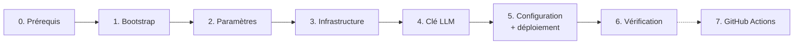

# 4. Premier déploiement, pas à pas

Ce guide part d'un compte AWS vide et aboutit à LogiFlow en ligne en HTTPS. Comptez environ
**45 minutes**, dont 15 d'attente. Chaque étape indique le **résultat attendu** : ne passez à la
suivante que s'il est obtenu.



## Étape 0 : prérequis

Toute la page [Prérequis](02-prerequis.md), en particulier :

- `make outils` affiche tout à `ok`, avec votre ARN AWS ;
- les images GHCR existent et sont **publiques**, sinon prévoyez le jeton (§ 2.3) ;
- une clé Groq est disponible.

```bash
git clone https://github.com/ibrahim-stitou/logiflow-infra.git ~/logiflow-infra
cd ~/logiflow-infra
```

## Étape 1 : bootstrap (une seule fois par compte AWS)

Cette étape crée ce dont Terraform a besoin pour travailler proprement :

- le bucket S3 de l'**état Terraform**, versionné, chiffré et verrouillé ;
- le fournisseur **OIDC GitHub** ;
- les deux **rôles** assumables par les workflows GitHub.

```bash
make bootstrap
```

Terraform affiche le plan, puis demande confirmation : répondre `yes`.

> Si votre dépôt n'est pas `ibrahim-stitou/logiflow-infra`, passez les variables :
> `terraform -chdir=terraform/bootstrap apply -var github_owner=<compte>`.

Résultat attendu :

```
Outputs:
bucket_etat              = "logiflow-tfstate-123456789012"
role_github_deploiement  = "arn:aws:iam::123456789012:role/logiflow-github-deploiement"
role_github_terraform    = "arn:aws:iam::123456789012:role/logiflow-github-terraform"
```

Notez ces trois valeurs : elles servent à l'étape 7.

> L'état du bootstrap reste **local** (`terraform/bootstrap/terraform.tfstate`, ignoré par Git).
> Il ne décrit que ces quelques ressources ; conservez le fichier (ou recréez les ressources par
> import) si vous voulez les supprimer proprement plus tard.

## Étape 2 : paramètres de l'environnement

```bash
cd terraform/environments/prod
cp backend.hcl.example backend.hcl
cp terraform.tfvars.example terraform.tfvars
cd -
```

1. Dans `backend.hcl`, remplacez `<ID_COMPTE_AWS>` : le nom exact est la sortie `bucket_etat`
   de l'étape 1.
2. Dans `terraform.tfvars`, **renseignez `email_alertes`**. Les autres valeurs par défaut
   conviennent :

| Variable | Défaut | Rôle |
|---|---|---|
| `email_alertes` | — | **Obligatoire** : destinataire des alertes de budget |
| `type_instance` | `t3.large` | 8 Go de mémoire (voir [coûts](08-couts.md)) |
| `budget_mensuel_usd` | `30` | Alertes à 50, 80 et 100 % du réel, et à 100 % du prévisionnel |
| `domaine` | `""` | Vide : `app.<ip>.sslip.io`. Sinon `app.<domaine>` et `auth.<domaine>` (§ Domaine personnalisé) |
| `donnees_demo` | `true` | Jeu de démonstration et 6 comptes (un par rôle) |
| `mfa_obligatoire` | `false` | Le backend exige l'OTP dans les jetons |
| `arret_automatique` | `true` | Arrêt chaque soir à 20 h (heure de Paris) |
| `demarrage_automatique` | `false` | Démarrage à 8 h du lundi au vendredi |
| `retention_sauvegardes_jours` | `14` | Durée de conservation dans S3 |

```bash
make init
```

Résultat attendu : `Terraform has been successfully initialized!`, puis l'installation des
collections Ansible.

## Étape 3 : créer l'infrastructure

```bash
make plan     # facultatif : liste les ressources qui seront créées (≈ 35)
make apply    # répondre « yes »
```

Durée : environ 3 minutes. Résultat attendu :

```
Outputs:
bucket_sauvegardes = "logiflow-prod-sauvegardes-123456789012"
bucket_transferts  = "logiflow-prod-transferts-123456789012"
instance_id        = "i-0abc123def4567890"
ip_publique        = "13.38.1.2"
prefixe_ssm        = "/logiflow/prod"
region             = "eu-west-3"
url_application    = "https://app.13-38-1-2.sslip.io"
url_keycloak       = "https://auth.13-38-1-2.sslip.io"
```

À ce stade :

- le serveur Ubuntu tourne, mais aucune application n'est installée ;
- tous les secrets (mots de passe des bases, de Keycloak et des comptes de démo, clés internes)
  ont été **générés** dans SSM Parameter Store ;
- AWS envoie un e-mail de confirmation d'abonnement aux alertes de budget : pensez à le valider.

> Attendez **2 à 3 minutes** avant l'étape 5 : l'agent SSM du serveur doit s'enregistrer. Pour
> vérifier : `aws ssm describe-instance-information --query 'InstanceInformationList[].PingStatus'`
> doit afficher `Online`.

## Étape 4 : enregistrer la clé LLM

```bash
make secret-llm CLE=gsk_votre_cle
```

Résultat attendu : `clé LLM enregistrée`.

> Astuce : précédez la commande d'une espace pour qu'elle n'entre pas dans l'historique du shell
> (`HISTCONTROL=ignorespace`, réglage par défaut sous Ubuntu).

Si les paquets GHCR sont **privés**, enregistrez aussi `ghcr-user` et `ghcr-token` maintenant
(voir [§ 2.3](02-prerequis.md#images-docker-ghcr)).

## Étape 5 : configurer le serveur et déployer

```bash
make configure
```

Ansible se connecte au serveur **par SSM**, sans SSH, et exécute dans l'ordre :

| Rôle | Actions |
|---|---|
| `base` | Paquets, mises à jour de sécurité automatiques, fuseau Europe/Paris, swap de 2 Go, désactivation de SSH |
| `docker` | Docker Engine et Compose depuis le dépôt officiel, rotation des journaux |
| `logiflow` | Lecture des secrets et de la configuration dans SSM, copie de la stack dans `/opt/logiflow`, génération de `.env` (droits 600), puis `deployer.sh` : téléchargement des images, démarrage, comptes Keycloak, contrôle de santé HTTPS |
| `sauvegardes` | Sauvegarde quotidienne à 19 h 45 vers S3 |

Durée : environ 10 minutes au premier passage (téléchargement des images, première migration de
base, émission des certificats). Résultat attendu, en fin de journal :

```
[...] OK : https://app.13-38-1-2.sslip.io répond
SERVICE    STATUS
backend    Up 2 minutes (healthy)
...
PLAY RECAP
i-0abc123def4567890 : ok=42 changed=30 unreachable=0 failed=0
```

## Étape 6 : vérifier

```bash
make identifiants
```

Résultat :

```
Application : https://app.13-38-1-2.sslip.io
Keycloak    : https://auth.13-38-1-2.sslip.io/admin
Admin Keycloak : admin / Xy...
Comptes de démo (admin, responsable, exploitant, commercial, atelier, chauffeur) : Ab...
```

Parcours de vérification :

1. Ouvrir l'URL de l'application : on est redirigé vers la page de connexion LogiFlow de
   Keycloak.
2. Se connecter avec `admin` et le mot de passe de démo : le tableau de bord s'affiche.
3. Ouvrir un module, par exemple **Flotte** : les données de démonstration sont présentes.
4. Ouvrir le **copilote** et poser une question (« Quels véhicules sont en maintenance ? »). La
   réponse doit arriver en flux continu (streaming).
5. `make etat` : tous les services sont `healthy` et l'API répond `UP`.

**LogiFlow est en production.** Le serveur s'arrêtera ce soir à 20 h ; il se relance par
`make demarrer`.

## Étape 7 : brancher GitHub Actions (facultatif)

Cette étape permet d'appliquer Terraform et de déployer depuis GitHub, sans poste configuré.

1. Poussez le dépôt sur GitHub, si ce n'est déjà fait.
2. *Settings → Environments → New environment* : `production`. Cochez **Required reviewers**
   (vous-même) : chaque `apply` et chaque déploiement demandera une approbation.
3. *Settings → Secrets and variables → Actions → **Variables*** (ce ne sont pas des secrets, car
   il n'y a aucune clé) :

| Variable | Valeur (sorties de l'étape 1) |
|---|---|
| `AWS_ROLE_TERRAFORM` | `arn:aws:iam::<compte>:role/logiflow-github-terraform` |
| `AWS_ROLE_DEPLOIEMENT` | `arn:aws:iam::<compte>:role/logiflow-github-deploiement` |
| `TF_STATE_BUCKET` | `logiflow-tfstate-<compte>` |
| `EMAIL_ALERTES` | la même adresse que dans `terraform.tfvars` |

4. Test : *Actions → Déployer → Run workflow*, puis approuver. Le workflow démarre le serveur
   s'il est arrêté, et déploie.

Le fonctionnement détaillé, et le déploiement automatique à chaque push des dépôts applicatifs,
sont décrits dans [CI/CD](06-ci-cd.md).

---

## Variante : domaine personnalisé

Pour utiliser `app.mondomaine.fr` au lieu de sslip.io :

1. `domaine = "mondomaine.fr"` dans `terraform.tfvars`, puis `make apply`.
2. Chez le registraire, créez deux enregistrements **A** vers la sortie `ip_publique` :
   `app.mondomaine.fr` et `auth.mondomaine.fr`.
3. Attendez la propagation (`dig +short app.mondomaine.fr`), puis lancez `make configure-app`.

Caddy obtient les certificats automatiquement. `keycloak-init` réaligne les URL autorisées du
client `logiflow-frontend` (redirections, origines) sur le nouveau domaine à chaque
déploiement.

## En cas d'échec

Consultez le [Dépannage](09-depannage.md). Les étapes sont **idempotentes** : après correction,
relancez simplement la commande qui a échoué (`make apply`, `make configure`).
