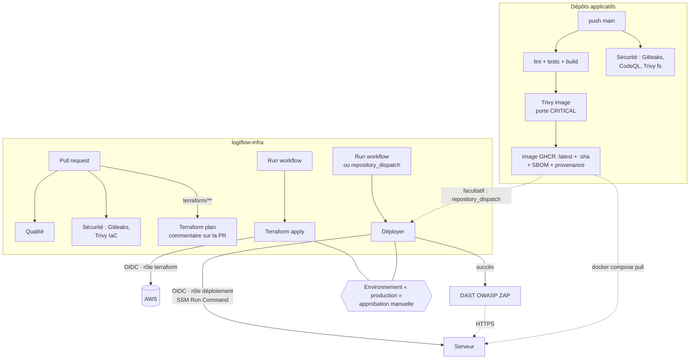

# 6. CI/CD

## 6.1 Vue d'ensemble



| Workflow | Déclencheur | Rôle AWS | Effet |
|---|---|---|---|
| **Qualité** (`qualite.yml`) | push, pull request | aucun | Contrôles statiques, sans accès AWS |
| **Terraform** (`terraform.yml`) | PR touchant `terraform/` ; manuel `plan` ou `apply` | `logiflow-github-terraform` | `plan` publié sur la PR ; `apply` après approbation |
| **Déployer** (`deployer.yml`) | manuel ; `repository_dispatch` de type `deployer` | `logiflow-github-deploiement` | Démarre le serveur si besoin, lance `deployer.sh` par SSM |
| **Sécurité** (`securite.yml`, dans les 4 dépôts) | push, pull request, chaque lundi, manuel | aucun | Gitleaks, CodeQL, Trivy (dépendances, IaC, images publiées) → onglet *Security* |
| **DAST (OWASP ZAP)** (`dast.yml`) | après un déploiement réussi ; manuel | aucun | Scan baseline de `app.` et `auth.` en ligne, rapports en artefacts |

Le détail des outils de sécurité est dans [Outils de sécurité](10-outils-securite.md).

## 6.2 Qualité

| Job | Outils | Vérifie |
|---|---|---|
| Terraform | `terraform fmt`, `validate`, **tflint** (règles AWS) | Format, cohérence, erreurs AWS (types d'instance, etc.) |
| Ansible | **ansible-lint**, profil `production` | Bonnes pratiques, idempotence, noms de tâches |
| Stack | **shellcheck**, `docker compose config`, `caddy validate`, `jq` | Scripts, Compose, Caddyfile, JSON du realm |

Le même ensemble s'exécute en local avec `make valider`.

## 6.3 Authentification sans clé (OIDC)

GitHub Actions n'a **aucune clé AWS**. À chaque exécution, il obtient de GitHub un jeton OIDC
signé que AWS échange contre des identifiants temporaires (une heure), à condition que le jeton
corresponde à la politique de confiance du rôle :

| Rôle | Accepté pour | Droits |
|---|---|---|
| `logiflow-github-terraform` | `repo:<propriétaire>/logiflow-infra` : pull requests, branche `main`, environnement `production` | EC2, SSM, S3, CloudWatch, Budgets, Scheduler, enregistrements Route 53 ; IAM limité aux ressources `logiflow-*` |
| `logiflow-github-deploiement` | environnement `production` uniquement | Décrire et démarrer les instances ; `SendCommand` limité à `AWS-RunShellScript` sur les instances du projet |

Un fork ou un autre dépôt ne peut pas assumer ces rôles. Le rôle de déploiement ne peut rien
créer ni supprimer.

## 6.4 Configuration du dépôt (une fois)

Voir aussi l'[étape 7 du premier déploiement](04-premier-deploiement.md#étape-7--brancher-github-actions-facultatif).

1. **Environnement** *Settings → Environments → `production`* :
   - *Required reviewers* : vous (et éventuellement votre binôme) ;
   - *Deployment branches* : `main` uniquement.
2. **Variables** *Settings → Secrets and variables → Actions → Variables* :

| Variable | Exemple |
|---|---|
| `AWS_ROLE_TERRAFORM` | `arn:aws:iam::123456789012:role/logiflow-github-terraform` |
| `AWS_ROLE_DEPLOIEMENT` | `arn:aws:iam::123456789012:role/logiflow-github-deploiement` |
| `TF_STATE_BUCKET` | `logiflow-tfstate-123456789012` |
| `EMAIL_ALERTES` | `vous@exemple.fr` |
| `DOMAINE` | `votre-domaine.com` (vide : sslip.io) |

3. **Protection de `main`** (recommandé) : *Settings → Branches → Add rule*, avec pull request
   obligatoire et le workflow **Qualité** requis.

> **Valeurs Terraform en CI** : `terraform.tfvars` n'est pas versionné. En CI, Terraform utilise
> donc les **valeurs par défaut** de `variables.tf`, plus `EMAIL_ALERTES`. Pour qu'un réglage
> s'applique aussi en CI (horaires, budget, domaine…), modifiez la valeur par défaut dans
> `variables.tf` (par une PR) plutôt que dans votre `terraform.tfvars`. Sinon un `apply` en CI
> annulerait votre réglage local.

## 6.5 Flux de travail recommandé

**Modifier l'infrastructure :**

1. Créer une branche et modifier `terraform/`.
2. Ouvrir une PR : *Qualité* et *Terraform plan* s'exécutent, et le plan est commenté sur la PR.
3. Relire le plan, puis fusionner.
4. *Actions → Terraform → Run workflow → `apply`* et approuver.

**Modifier la stack (`stack/`, `ansible/`) :**

1. Faire une PR, attendre *Qualité*, fusionner.
2. Depuis un poste : `make configure-app`. Ansible copie les fichiers et régénère `.env`.

**Mettre en production une nouvelle version de l'application :**

1. Fusionner dans `main` du dépôt applicatif ; sa CI publie l'image.
2. *Actions → Déployer → Run workflow*, approuver, puis consulter le résumé.

## 6.6 Déploiement automatique depuis un dépôt applicatif (facultatif)

Pour qu'un push sur `main` d'un dépôt applicatif déclenche le déploiement, sa CI envoie un
événement `repository_dispatch` à `logiflow-infra`, **après** la publication de l'image.

1. Créez un jeton GitHub *fine-grained* limité au dépôt `logiflow-infra`, avec la permission
   **Contents : Read and write** (requise par l'API `dispatches`). Pour le frontend, le jeton
   doit être créé par un compte qui a accès à `logiflow-infra`.
2. Dans le dépôt applicatif, ajoutez le secret `INFRA_DISPATCH_TOKEN`.
3. Ajoutez cette étape à la fin du job qui publie l'image :

```yaml
      - name: Déclencher le déploiement
        if: github.event_name == 'push' && github.ref == 'refs/heads/main'
        run: |
          curl -fsS -X POST \
            -H "Authorization: Bearer ${{ secrets.INFRA_DISPATCH_TOKEN }}" \
            -H "Accept: application/vnd.github+json" \
            https://api.github.com/repos/ibrahim-stitou/logiflow-infra/dispatches \
            -d '{"event_type":"deployer","client_payload":{"depot":"${{ github.repository }}","sha":"${{ github.sha }}"}}'
```

Le workflow *Déployer* démarre alors et **attend l'approbation** de l'environnement
`production`. Retirez le *reviewer* requis si vous voulez un déploiement continu sans validation.

> Le serveur étant éteint la nuit, un push nocturne le rallume pour déployer. Il sera éteint au
> prochain passage de la planification (20 h le lendemain), ou manuellement par `make arreter`.

## 6.7 Images applicatives

| Dépôt | Job | Images | Étiquettes |
|---|---|---|---|
| logiflow-backend | `ci.yml` | `logiflow-backend`, `logiflow-postgres`, `logiflow-keycloak` | `latest`, SHA |
| logiflow-ai-service | CI | `logiflow-ai-service` | `latest`, SHA |
| logiflow-frontend | `ci.yml` job `docker` | `logiflow-frontend` | `latest`, SHA |

Les images ne sont publiées **qu'après des tests verts et une analyse Trivy sans CVE CRITIQUE corrigeable**, uniquement sur `main`, avec leur **SBOM** et leur **provenance** SLSA attachés. Les pull
requests construisent l'image, sans la publier, pour détecter tôt un Dockerfile cassé.

L'image frontend est **indépendante de l'environnement** : l'URL Keycloak est injectée au
démarrage du conteneur (`config.js`, variables `AUTH_MODE`, `KEYCLOAK_URL`, `KEYCLOAK_REALM` et
`KEYCLOAK_CLIENT_ID`). La même image sert donc en local et en production.
