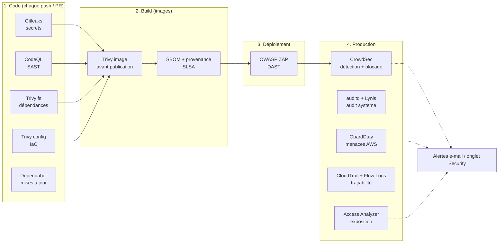

# 10. Outils de sécurité (DevSecOps)

La sécurité est contrôlée **à chaque étape** du cycle de vie, du commit à la production, avec des
outils open source ou gratuits, standards de l'industrie.



| Couche | Outil | Où | Bloquant ? | Résultats |
|---|---|---|---|---|
| Secrets | **Gitleaks** | 4 dépôts, tout l'historique | **Oui** | Journal du workflow *Sécurité* |
| SAST | **CodeQL** (`security-extended`) | backend (Java), frontend (TS), IA (Python) | Non (alertes) | *Security → Code scanning* |
| Dépendances | **Trivy fs** | 3 dépôts applicatifs | **Oui** sur CVE CRITIQUE corrigeable | *Code scanning* (HIGH+CRITICAL) |
| Mises à jour | **Dependabot** | 4 dépôts : bibliothèques, images de base, actions, providers Terraform | — | Pull requests hebdomadaires |
| IaC | **Trivy config** | logiflow-infra (Terraform, Compose, Dockerfiles) | **Oui** sur CRITIQUE | *Code scanning* |
| Images | **Trivy image** | CI de publication, avant `push` | **Oui** pour les images applicatives | Journal du job Docker |
| Chaîne d'approvisionnement | **SBOM + provenance** (BuildKit, SLSA) | Chaque image publiée | — | Attestations dans GHCR |
| Images publiées | **Trivy image** hebdomadaire | 5 images `latest` | Non | *Code scanning* |
| DAST | **OWASP ZAP** baseline | `app.` et `auth.` en ligne, après chaque déploiement | Non | Artefacts du workflow *DAST* |
| Hôte | **CrowdSec** + bouncer pare-feu | Serveur | Blocage automatique des IP | `make securite` |
| Hôte | **auditd** | Serveur | — | `make journal-audit` |
| Hôte | **Lynis** | Serveur, hebdomadaire | — | `make audit` |
| Hôte | Noyau durci (sysctl), Docker `no-new-privileges`, conteneurs sans capacités, non-root | Serveur | — | `make audit` |
| AWS | **GuardDuty** | Compte (eu-west-3) | — | E-mail + `make alertes-securite` |
| AWS | **IAM Access Analyzer** | Compte | — | E-mail |
| AWS | **CloudTrail** (multi-régions, fichiers signés) + **VPC Flow Logs** | Compte, VPC | — | Bucket `…-journaux-…` (90 jours) |

## 10.1 Dans la CI (GitHub Actions)

Chaque dépôt contient un workflow **`Sécurité`** (`.github/workflows/securite.yml`), déclenché à
chaque push sur `main`, à chaque pull request, **chaque lundi** (pour détecter les nouvelles CVE
dans un code qui n'a pas changé) et à la demande.

### Gitleaks (secrets)

Il analyse **tout l'historique Git** à la recherche de clés, jetons et mots de passe : clés AWS,
clés Groq `gsk_…`, clés privées, jetons GitHub… Une fuite fait échouer le workflow.

> Un secret poussé sur GitHub doit être considéré comme **compromis**, même s'il est supprimé
> ensuite : il faut le **révoquer et le régénérer** (`make secret-llm`, `terraform apply -replace`,
> voir [Exploitation § 5.8](05-exploitation.md#58-secrets-et-configuration)), puis réécrire
> l'historique si nécessaire.

### CodeQL (SAST)

Il analyse statiquement le code source avec la suite `security-extended` : injections SQL et de
commandes, XSS, désérialisation, SSRF, chemins de fichiers, cryptographie faible… Les alertes
apparaissent dans **Security → Code scanning**, avec le chemin de données incriminé, et sont
commentées sur les pull requests.

### Trivy (dépendances, IaC, images)

| Analyse | Porte bloquante | Rapport (onglet Security) |
|---|---|---|
| `fs` : `pom.xml`, `pnpm-lock.yaml`, `uv.lock` | CVE **CRITIQUE avec correctif disponible** | HIGH + CRITICAL |
| `config` : Terraform, Compose, Dockerfiles | Mauvaise configuration **CRITIQUE** | MEDIUM + HIGH + CRITICAL |
| `image` : avant publication sur GHCR | CVE CRITIQUE corrigeable (images applicatives) | Journal du job |

Pourquoi « corrigeable » (`ignore-unfixed`) ? Bloquer sur une CVE sans correctif empêcherait
tout déploiement, sans action possible. Ces CVE restent visibles dans le rapport.

Les images **PostgreSQL** et **Keycloak** dérivent d'images tierces : leur analyse est un
rapport non bloquant, suivi chaque semaine. On les met à jour via les PR Dependabot sur les
images de base.

### Chaîne d'approvisionnement

- **Actions épinglées par SHA de commit** dans les workflows de sécurité. En mars 2026, les
  étiquettes de `aquasecurity/trivy-action` ont été détournées pour voler les secrets des CI
  ([avis GHSA-69fq-xp46-6x23](https://github.com/aquasecurity/trivy/security/advisories/GHSA-69fq-xp46-6x23)).
  Un SHA ne peut pas être déplacé. Dependabot propose les mises à jour de ces SHA.
- **Analyse avant publication** : une image vulnérable n'atteint jamais GHCR, donc jamais la
  production.
- **SBOM** (inventaire des composants, SPDX) et **provenance SLSA** attachés à chaque image.
  Pour les consulter :

  ```bash
  docker buildx imagetools inspect ghcr.io/ibrahim-stitou/logiflow-backend:latest --format '{{ json .SBOM }}'
  docker buildx imagetools inspect ghcr.io/ibrahim-stitou/logiflow-backend:latest --format '{{ json .Provenance }}'
  ```

- **Images épinglées** : `uv` à une version fixe, dépendances verrouillées (lockfiles
  `--frozen`).

### Traiter une vulnérabilité

1. **Lire l'alerte** (onglet Security ou journal du job) : paquet, version installée, version
   corrigée, gravité.
2. **Corriger**, de préférence :
   - dépendance directe : monter la version (ou fusionner la PR Dependabot) ;
   - dépendance transitive gérée par Spring Boot : surcharger la propriété de version dans
     `pom.xml` (ex. `<tomcat.version>`), en attendant la version corrective de Spring Boot ;
   - image de base : reconstruire (le `latest` de la base est souvent déjà corrigé), ou monter la
     balise.
3. **Accepter** une CVE seulement si elle n'est **pas exploitable** dans notre contexte
   (fonction non utilisée, composant non exposé). Ajoutez-la à `.trivyignore` avec sa
   justification et une date de revue :

   ```
   CVE-2026-12345   # module XML non utilisé (pas d'entrée XML) - revue le 2026-10-01
   ```

   Pour l'IaC, l'exception se place **sur la ressource concernée**, avec un commentaire
   `#trivy:ignore:AWS-XXXX` et sa justification. Les écarts actuels sont listés dans
   [Sécurité § 7.7](07-securite.md#77-écarts-assumés).
4. Dans l'onglet Security, fermez l'alerte comme *Won't fix* ou *Used in tests*, avec un
   commentaire.

### Réglages GitHub à activer (une fois par dépôt)

*Settings → Code security* :

- **Dependabot alerts** et **Dependabot security updates** ;
- **Secret scanning** et **Push protection** : GitHub **refuse** le push d'un secret reconnu,
  avant même Gitleaks ;
- **Private vulnerability reporting** (facultatif).

Commande équivalente, pour chaque dépôt :

```bash
for r in logiflow-backend logiflow-frontend logiflow-ai-service logiflow-infra; do
  gh api -X PATCH repos/ibrahim-stitou/$r --input - <<'JSON'
{"security_and_analysis":{"secret_scanning":{"status":"enabled"},"secret_scanning_push_protection":{"status":"enabled"}}}
JSON
  gh api -X PUT repos/ibrahim-stitou/$r/vulnerability-alerts
  gh api -X PUT repos/ibrahim-stitou/$r/automated-security-fixes
done
```

Enfin, rendez les workflows **Sécurité** et **CI** obligatoires avant fusion : *Settings →
Branches → Branch protection rule* sur `main`.

## 10.2 DAST : OWASP ZAP

Le workflow **`DAST (OWASP ZAP)`** de `logiflow-infra` teste l'application **en fonctionnement**,
comme le ferait un attaquant, sur `https://app.<domaine>` et `https://auth.<domaine>`.

- **Déclenchement** : automatiquement après chaque déploiement réussi (workflow *Déployer*), ou à
  la demande (*Actions → DAST → Run workflow*, serveur allumé).
- **Mode baseline** : il explore l'application, y compris le rendu Angular (spider AJAX), puis
  applique des règles **passives** (en-têtes, cookies, fuites d'information, contenu mixte…). Il
  n'envoie aucune attaque active et ne présente aucun risque pour les données.
- **Rapports** : artefacts `zap-app` et `zap-auth` du workflow (HTML, JSON, Markdown).
- **Règles** : `.zap/rules.tsv`.
  - `FAIL` : l'absence de HSTS, `X-Frame-Options` ou `X-Content-Type-Options` fait échouer
    l'analyse.
  - `IGNORE` : faux positifs justifiés (horodatages des bundles, commentaires minifiés…).
  - `WARN` : à surveiller.

> **ZAP va se faire bloquer par CrowdSec**, et c'est normal : un scan est précisément ce que
> CrowdSec détecte. L'IP du runner GitHub est bannie pour 4 h après quelques centaines de
> requêtes. Cela démontre que la protection fonctionne, mais le rapport peut alors être partiel.
> Pour un rapport complet (par exemple avant une soutenance), lancez `make securite`, repérez
> l'IP du runner, puis `make debloquer IP=<ip>` et relancez le workflow.

Aller plus loin : un **scan complet** (`zaproxy/action-full-scan`, attaques actives) ne doit
être lancé que sur un environnement de test. Un **scan d'API** authentifié peut s'appuyer sur
`/v3/api-docs`.

## 10.3 Sur le serveur

### CrowdSec (détection d'intrusion et blocage)

[CrowdSec](https://www.crowdsec.net/) lit les **journaux d'accès de Caddy** (JSON) et ceux du
système, y reconnaît des **scénarios d'attaque**, puis fait **bloquer l'IP au pare-feu** par son
*bouncer*. Il contrôle les chaînes `INPUT` et `DOCKER-USER`, ce qui couvre aussi les ports
publiés par Docker. Les scénarios détectés :

- scans et découverte de chemins (`http-probing`, `http-crawl-non_statics`, `http-sensitive-files`) ;
- tentatives d'exploitation de CVE connues (`http-cve` : Log4Shell, Spring4Shell, traversées…) ;
- force brute HTTP, agents malveillants connus (`http-bad-user-agent`) ;
- listes de réputation communautaires : les IP signalées par la communauté CrowdSec sont
  bloquées **préventivement**.

```bash
make securite                 # journaux analysés, IP bloquées, dernières alertes
make debloquer IP=1.2.3.4     # lever un blocage (faux positif)
```

> Keycloak protège en plus les comptes contre la force brute (verrouillage temporaire après
> plusieurs échecs), au niveau applicatif.

### auditd (journal d'audit)

Il trace les accès aux fichiers sensibles : lecture ou modification de `/opt/logiflow/.env`
(secrets), de la configuration Docker, des comptes et du `sudo`, ainsi que l'usage de la
commande `docker`.

```bash
make journal-audit                  # accès aux secrets aujourd'hui
make journal-audit CLE=docker-cli   # commandes docker du jour
```

### Lynis (audit de configuration)

Il audite chaque semaine (dimanche 4 h) plus de 250 points de configuration : noyau, services,
paquets, droits, journalisation…

```bash
make audit    # indice de durcissement /100, avertissements, suggestions
```

L'indice attendu se situe autour de **75 à 80**. Les suggestions restantes concernent surtout
des choix assumés : pas de SSH, donc sans objet ; mot de passe GRUB inutile sur EC2, par
exemple.

### Durcissement appliqué

| Élément | Mesure |
|---|---|
| Noyau | Redirections ICMP et routage source refusés, SYN cookies, paquets suspects journalisés, pointeurs noyau masqués, `dmesg` restreint, BPF non privilégié désactivé, liens protégés |
| Docker | `no-new-privileges` global, pas de proxy utilisateur (IP clientes réelles), rotation des journaux |
| Conteneurs | Tous en `no-new-privileges` ; `cap_drop: ALL` sauf PostgreSQL (entrypoint officiel) ; Caddy ne garde que `NET_BIND_SERVICE` ; backend, IA, frontend et Keycloak **non-root** |
| Système | Mises à jour de sécurité automatiques, SSH désactivé, IMDSv2 obligatoire |

## 10.4 Dans AWS

| Service | Rôle | Coût |
|---|---|---|
| **GuardDuty** | Détection de menaces à partir de CloudTrail, des flux VPC, du DNS et des accès S3 : minage de cryptomonnaie, communication avec des serveurs de commande connus, identifiants de l'instance utilisés hors d'AWS, accès anormal aux sauvegardes, reconnaissance de ports… | 30 jours gratuits, puis ≈ 1 $/mois ici |
| **IAM Access Analyzer** | Signale toute ressource (bucket, rôle, clé…) accessible depuis l'extérieur du compte | Gratuit |
| **CloudTrail** | Journal de **toutes les actions API** du compte, toutes régions, avec fichiers de condensat signés (preuve d'intégrité), conservé 90 jours dans S3 | Gratuit (1re copie) + stockage S3 négligeable |
| **VPC Flow Logs** | Journal de toutes les connexions réseau (acceptées et rejetées) du VPC, dans S3 | ≈ 0,10 $/mois |
| **Alertes** | GuardDuty (sévérité ≥ 4) et Access Analyzer → EventBridge → SNS → **e-mail** | Gratuit |

> Après `make apply`, **confirmez l'abonnement** dans l'e-mail « AWS Notification - Subscription
> Confirmation ». Sans cette confirmation, aucune alerte n'est envoyée.

```bash
make alertes-securite     # découvertes GuardDuty actives
```

Pour vérifier la chaîne d'alerte, générez des découvertes d'exemple (préfixées `[SAMPLE]`) :

```bash
aws guardduty create-sample-findings --detector-id $(aws guardduty list-detectors --query 'DetectorIds[0]' --output text) \
  --finding-types Recon:EC2/PortProbeUnprotectedPort
```

Pour vérifier l'intégrité des journaux CloudTrail :

```bash
aws cloudtrail validate-logs --trail-arn $(aws cloudtrail describe-trails --query 'trailList[0].TrailARN' --output text) \
  --start-time $(date -u -d '-1 day' +%Y-%m-%dT%H:%M:%SZ)
```

**Écartés** (budget de 70 $) :

- **Security Hub** : ≈ 10 $/mois avec ses standards CIS et FSBP ;
- **AWS Config** : ≈ 2 à 5 $/mois par enregistreur ;
- **Inspector** : GuardDuty, Trivy et Lynis couvrent l'essentiel ici ;
- **WAF** : nécessite ALB ou CloudFront.

Voir [Sécurité § 7.7](07-securite.md#77-écarts-assumés).

## 10.5 Réagir à une alerte

| Alerte | Première réaction |
|---|---|
| Gitleaks / Push protection | Révoquer et régénérer le secret, **puis** nettoyer le dépôt |
| CVE CRITIQUE (CI bloquée) | Monter la dépendance ou l'image ([Traiter une vulnérabilité](#traiter-une-vulnérabilité)) |
| ZAP `FAIL` | Corriger l'en-tête ou la configuration (Caddy, nginx), redéployer |
| GuardDuty `UnauthorizedAccess:IAMUser/InstanceCredentialExfiltration…` | Identifiants de l'instance volés : `make arreter`, révoquer les sessions du rôle (*IAM → Roles → logiflow-prod-serveur → Revoke active sessions*), analyser CloudTrail, reconstruire le serveur ([§ 9.7](09-depannage.md#97-tout-reconstruire)) |
| GuardDuty `CryptoCurrency:` / `Backdoor:` / `Trojan:` | Serveur compromis : `make arreter`, **snapshot du disque** pour analyse, reconstruire, régénérer **tous** les secrets, restaurer une sauvegarde antérieure |
| GuardDuty `Recon:` (scan de ports) | Bruit d'Internet habituel : vérifier que seuls 80/443 répondent, rien d'autre à faire |
| Access Analyzer | Ressource exposée hors du compte : corriger la politique (Terraform), puis archiver la découverte |
| CrowdSec : pic de blocages | Attaque en cours, déjà bloquée : vérifier `make securite` et les journaux de Caddy |
