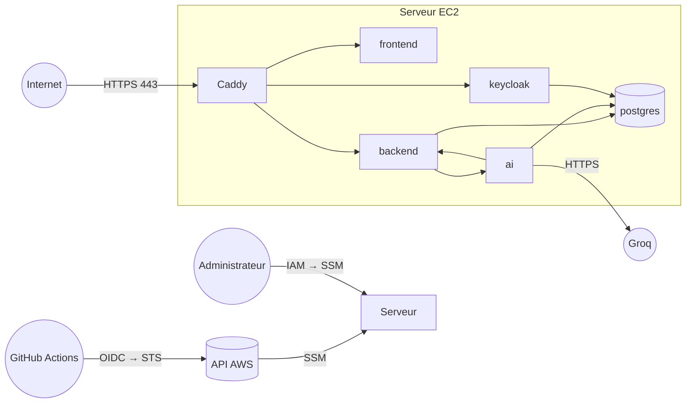
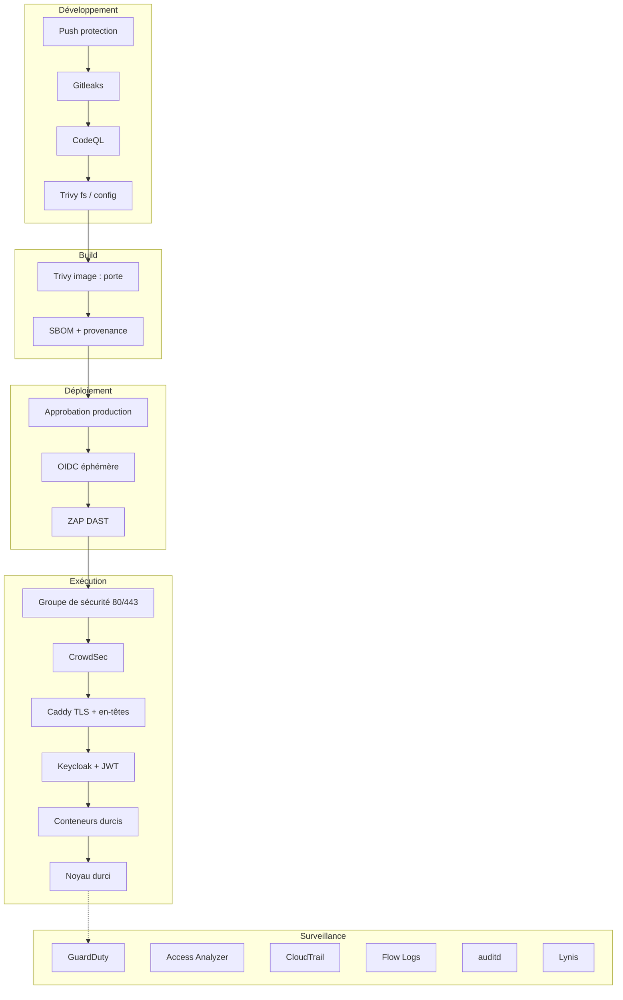

# 11. Sécurité : référence détaillée

Ce document est la **référence complète** de la sécurité de LogiFlow. Il contient :

1. le **modèle de menaces** et la correspondance menace → contrôle ;
2. une **fiche détaillée par outil** : rôle, fonctionnement, configuration exacte (fichiers),
   exécution, lecture des résultats, limites ;
3. des **scénarios de démonstration** reproductibles, qui prouvent que chaque contrôle fonctionne
   (utiles pour une soutenance) ;
4. la **liste des preuves** à collecter.

Pour une vue d'ensemble plus courte, voir [Outils de sécurité](10-outils-securite.md). Les choix
et les écarts assumés sont dans [Sécurité](07-securite.md) et l'[ADR 0005](adr/0005-chaine-devsecops.md).

---

## Sommaire

- [11.1 Périmètre et actifs](#111-périmètre-et-actifs)
- [11.2 Modèle de menaces (STRIDE)](#112-modèle-de-menaces-stride)
- [11.3 Défense en profondeur](#113-défense-en-profondeur)
- [11.4 Fiches outils : CI/CD](#114-fiches-outils--cicd)
- [11.5 Fiches outils : serveur](#115-fiches-outils--serveur)
- [11.6 Fiches outils : AWS](#116-fiches-outils--aws)
- [11.7 Scénarios de démonstration](#117-scénarios-de-démonstration)
- [11.8 Preuves à collecter](#118-preuves-à-collecter)
- [11.9 Maintenance de la sécurité](#119-maintenance-de-la-sécurité)
- [11.10 Correspondance avec les référentiels](#1110-correspondance-avec-les-référentiels)

---

## 11.1 Périmètre et actifs

| Actif | Où | Sensibilité | Conséquence d'une compromission |
|---|---|---|---|
| Données métier (flotte, dossiers, clients, maintenance, sinistres) | Base `logiflow` | Élevée | Fuite de données clients, perte d'activité |
| Conversations du copilote | Base `logiflow_ai` | Moyenne | Fuite d'informations métier |
| Comptes et sessions | Base `keycloak` | Élevée | Usurpation d'identité |
| Pièces jointes (factures, constats, contrats) | Volume `backend-uploads` | Élevée | Fuite de documents |
| Secrets (mots de passe des bases, admin Keycloak, clés internes, clé LLM) | SSM Parameter Store, `/opt/logiflow/.env` | Critique | Compromission totale |
| Identifiants AWS (rôle de l'instance, rôles CI) | IMDS, OIDC GitHub | Critique | Prise de contrôle du compte AWS, facturation |
| Code et images | GitHub, GHCR | Élevée | Injection de code malveillant (chaîne d'approvisionnement) |
| Sauvegardes | S3 `…-sauvegardes-…` | Élevée | Fuite, ou impossibilité de restaurer |
| Journaux d'audit | S3 `…-journaux-…` | Moyenne | Perte de traçabilité |

**Frontières de confiance :**



1. **Internet → Caddy** : seul point d'entrée public (80/443).
2. **Caddy → services** : réseau Docker interne, non exposé.
3. **Services → Internet** : Groq (LLM), OSRM, GHCR, Let's Encrypt, API AWS.
4. **GitHub / administrateurs → AWS** : identités IAM, sans clé longue durée pour la CI.

## 11.2 Modèle de menaces (STRIDE)

| # | Menace (STRIDE) | Scénario | Contrôles préventifs | Contrôles de détection |
|---|---|---|---|---|
| M1 | **S**poofing : usurpation d'utilisateur | Force brute ou vol de mot de passe sur la page de connexion | Keycloak : protection contre la force brute, MFA (OTP) activable, PKCE | CrowdSec (force brute HTTP), journaux Keycloak |
| M2 | **S**poofing : jeton forgé | Appel de l'API avec un JWT fabriqué | Signature vérifiée (JWKS Keycloak), émetteur et expiration contrôlés, profil `prod` sans accès anonyme | Journaux du backend (401) |
| M3 | **T**ampering : injection (SQL, commandes, XSS) | Requête malveillante vers l'API | JPA paramétré, validation, Angular (échappement par défaut) | **CodeQL** (SAST), **ZAP** (DAST), CrowdSec `http-cve` |
| M4 | **T**ampering : dépendance vulnérable | Exploitation d'une CVE connue (ex. Tomcat) | **Trivy** (portes CRITICAL), **Dependabot** | Réanalyse hebdomadaire, onglet *Security* |
| M5 | **T**ampering : chaîne d'approvisionnement | Action GitHub ou image de base compromise | Actions **épinglées par SHA**, analyse **avant** publication, SBOM et provenance, lockfiles `--frozen` | Dependabot (SHA), Trivy |
| M6 | **R**epudiation : action non tracée | Modification d'infrastructure ou lecture de secret non attribuable | Accès nominatifs (IAM, SSM), pas de compte partagé | **CloudTrail** (fichiers signés), **auditd** |
| M7 | **I**nformation disclosure : secret dans Git | Clé committée par erreur | `.gitignore`, secrets générés dans SSM, **push protection** GitHub | **Gitleaks** (tout l'historique) |
| M8 | **I**nformation disclosure : exposition réseau | Base ou service interne joignable depuis Internet | Groupe de sécurité 80/443 uniquement, aucun port interne publié, SSH désactivé | **VPC Flow Logs**, GuardDuty `Recon:` |
| M9 | **I**nformation disclosure : ressource AWS publique | Bucket de sauvegardes rendu public | *Block Public Access*, politiques restrictives | **IAM Access Analyzer** (alerte e-mail) |
| M10 | **I**nformation disclosure : vol des identifiants de l'instance | SSRF vers l'IMDS | **IMDSv2** obligatoire (hop limit 1) | **GuardDuty** `InstanceCredentialExfiltration` |
| M11 | **D**enial of service | Scan massif, inondation HTTP | Limites mémoire par conteneur, CrowdSec (blocage), SYN cookies | CrowdSec, alarme de récupération EC2 |
| M12 | **D**enial of service : destruction des données | Suppression des sauvegardes par un attaquant | Buckets **versionnés** ; le rôle du serveur ne peut pas supprimer de version | GuardDuty S3, CloudTrail |
| M13 | **E**levation of privilege : évasion de conteneur | Exploitation d'un conteneur puis de l'hôte | Conteneurs **non-root**, `cap_drop: ALL`, `no-new-privileges`, noyau durci | auditd (`docker-cli`), Lynis |
| M14 | **E**levation of privilege : CI détournée | Un fork ou une PR assume le rôle AWS | Confiance OIDC limitée au dépôt, à `main` et à l'environnement `production` ; approbation manuelle | CloudTrail (`AssumeRoleWithWebIdentity`) |
| M15 | **E**levation of privilege : mauvaise configuration IaC | Politique IAM trop large, bucket non chiffré | **Trivy config** (porte CRITICAL), revue du `plan` en PR | Access Analyzer |

## 11.3 Défense en profondeur



Aucun contrôle n'est seul : une faiblesse passée à travers une couche est rattrapée par la
suivante. Par exemple, une CVE Tomcat non corrigée est bloquée par Trivy au build. Si elle était
publiée, CrowdSec bloquerait sa tentative d'exploitation (`http-cve`), et l'exécution non-root
sans capacités limiterait l'impact.

---

## 11.4 Fiches outils : CI/CD

### Fiche 1 : Gitleaks (détection de secrets)

| | |
|---|---|
| **Menaces** | M7 |
| **Où** | Workflow `Sécurité`, job `Secrets (Gitleaks)`, dans les 4 dépôts |
| **Quand** | Push sur `main`, pull request, chaque lundi, manuel |
| **Configuration** | `.github/workflows/securite.yml` ; `gitleaks/gitleaks-action` v3.0.0 épinglée par SHA ; `fetch-depth: 0` (tout l'historique) |
| **Politique** | **Bloquant** : toute fuite fait échouer le workflow |

**Fonctionnement** : Gitleaks applique plus de 150 règles (expressions régulières et entropie)
à chaque commit de l'historique. Il reconnaît les clés AWS (`AKIA…`), les jetons GitHub
(`ghp_…`), les clés privées (`-----BEGIN … PRIVATE KEY-----`), les jetons JWT, les clés d'API
génériques…

**Lire le résultat** : dans le journal du job, chaque fuite indique le fichier, la ligne, le
commit, l'auteur et la règle déclenchée. Le secret est masqué.

**Faux positif** : ajoutez l'empreinte (*fingerprint*) indiquée dans un fichier
`.gitleaksignore` à la racine, avec un commentaire qui justifie l'exception.

**Limites** : Gitleaks ne détecte pas un secret de format inconnu et peu entropique (mot de
passe court par exemple). La politique « secrets générés dans SSM, jamais saisis » réduit ce
risque à la source.

**Complément** : la *push protection* de GitHub refuse le push **avant** qu'il n'atteigne le
dépôt (voir [§ 10.1](10-outils-securite.md#réglages-github-à-activer-une-fois-par-dépôt)).

### Fiche 2 : CodeQL (analyse statique, SAST)

| | |
|---|---|
| **Menaces** | M3 |
| **Où** | Job `SAST (CodeQL)` : backend `java-kotlin`, frontend `javascript-typescript`, IA `python` |
| **Configuration** | `build-mode: none` (analyse du source sans compilation), suite `security-extended` |
| **Politique** | Non bloquant : alertes dans *Security → Code scanning*, annotations sur les PR |

**Fonctionnement** : CodeQL transforme le code en base de données interrogeable, puis exécute
des requêtes de **suivi de flux** : une donnée contrôlée par l'utilisateur (paramètre HTTP) qui
atteint un point dangereux (requête SQL, commande système, rendu HTML, désérialisation, chemin
de fichier, URL sortante) sans passer par une validation. La suite `security-extended` ajoute des
requêtes plus sensibles (cryptographie faible, journaux contenant des données sensibles…).

**Lire le résultat** : chaque alerte montre le **chemin de données** (source → étapes → puits), sa
gravité et la règle (CWE). Pour une alerte non pertinente : *Dismiss* avec le motif (*False
positive*, *Used in tests*, *Won't fix*).

**Limites** : CodeQL ne voit pas les failles de logique métier, par exemple un contrôle
d'autorisation oublié sur un endpoint. Celles-ci relèvent des tests d'intégration (rôles) et de
la revue de code.

### Fiche 3 : Trivy (dépendances, IaC, images)

| Mode | Cible | Porte bloquante | Rapport |
|---|---|---|---|
| `fs` | `pom.xml`, `pnpm-lock.yaml`, `uv.lock` | CVE **CRITIQUE** avec correctif | SARIF HIGH + CRITICAL → *Code scanning* |
| `config` | Terraform, Compose, Dockerfiles (logiflow-infra) | Mauvaise configuration **CRITIQUE** | SARIF MEDIUM+ → *Code scanning* |
| `image` (CI) | Image construite localement, **avant** `push` | CVE CRITIQUE corrigeable (backend, IA, frontend) | Journal du job |
| `image` (hebdo) | Images `latest` publiées sur GHCR | Non | SARIF → *Code scanning* |

**Configuration** : `aquasecurity/trivy-action` v0.36.0, épinglée par SHA (version publiée après
l'incident de mars 2026). Les exceptions vont dans `.trivyignore` (CVE, justifiées et datées) ou
dans un commentaire `#trivy:ignore:AWS-XXXX` placé sur la ressource Terraform.

**Fonctionnement** : Trivy compare les versions de paquets (système Alpine, Debian ou Ubuntu, et
bibliothèques Java, npm et Python) à sa base de vulnérabilités (NVD, GitHub Advisories, bulletins
des distributions). En mode `config`, il applique des règles de bonnes pratiques : chiffrement,
exposition réseau, droits IAM, utilisateurs root dans les Dockerfiles…

**Exceptions IaC en vigueur** (toutes justifiées sur la ressource) :

| Règle | Ressource | Justification |
|---|---|---|
| AWS-0132 (clé KMS client) | Buckets état, sauvegardes, transferts, journaux | SSE-S3 suffisant ; clé client = 1 $/mois par clé |
| AWS-0104 (sortie ouverte) | Groupe de sécurité du serveur | Destinations multiples (GHCR, Groq, OSRM, Let's Encrypt, API AWS), pas de NAT ni de proxy |
| AWS-0015 / AWS-0162 | CloudTrail | Pas de clé KMS client ni de CloudWatch Logs (coût) ; intégrité par validation des fichiers |
| AWS-0095 | Sujet SNS des alertes | EventBridge ne peut pas publier vers un sujet chiffré par la clé AWS ; messages sans données sensibles |

**Résultat actuel** : 0 écart non justifié (MEDIUM à CRITICAL) sur l'IaC. Les images backend,
frontend et IA n'ont aucune CVE CRITIQUE corrigeable, après correction de Tomcat (11.0.26) et
d'OpenSSL (nginx 1.30-alpine).

### Fiche 4 : Dependabot

| | |
|---|---|
| **Menaces** | M4, M5 |
| **Configuration** | `.github/dependabot.yml` de chaque dépôt |
| **Écosystèmes** | Maven, npm (pnpm), uv, images Docker, actions GitHub (SHA), providers Terraform, images Compose |
| **Fréquence** | Hebdomadaire ; mises à jour mineures et correctifs **groupés** en une PR |

Avec *Dependabot security updates* activé, une PR est ouverte **immédiatement** pour toute
dépendance touchée par une alerte de sécurité. La CI complète (tests + sécurité) valide la PR
avant fusion.

### Fiche 5 : SBOM et provenance (chaîne d'approvisionnement)

| | |
|---|---|
| **Menaces** | M5 |
| **Où** | Étape « Publier l'image… » des CI (`sbom: true`, `provenance: mode=max`) |
| **Format** | SBOM SPDX ; provenance SLSA (dépôt, commit, workflow, paramètres de build), non signée |

```bash
# Inventaire des composants de l'image en production
docker buildx imagetools inspect ghcr.io/ibrahim-stitou/logiflow-backend:latest --format '{{ json .SBOM }}' | jq '.SPDX.packages | length'
# Provenance : quel commit et quel workflow ont produit l'image
docker buildx imagetools inspect ghcr.io/ibrahim-stitou/logiflow-backend:latest --format '{{ json .Provenance }}' | jq '.SLSA.invocation.configSource'
```

Intérêt : lorsqu'une nouvelle CVE est publiée, le SBOM dit **immédiatement** si la production est
concernée, sans reconstruire. La provenance prouve que l'image vient bien de la CI du dépôt, et
non d'un poste.

### Fiche 6 : OWASP ZAP (analyse dynamique, DAST)

| | |
|---|---|
| **Menaces** | M3, M8 (configuration HTTP) |
| **Où** | `logiflow-infra/.github/workflows/dast.yml` ; cibles `https://app.<domaine>` et `https://auth.<domaine>` |
| **Quand** | Après chaque workflow *Déployer* réussi ; manuel (paramètre `domaine` facultatif) |
| **Mode** | *Baseline* : spider classique et AJAX (`-j`), règles passives et alpha (`-a`) ; **aucune attaque active** |
| **Règles** | `.zap/rules.tsv` : `FAIL` (HSTS, anti-clickjacking, nosniff), `WARN` (CSP…), `IGNORE` justifiés |

**Lire le résultat** : artefacts `zap-app` et `zap-auth` → `report_html.html`. Chaque alerte
indique son niveau de risque, sa confiance, les URL touchées, sa preuve et une solution.

**Interaction avec CrowdSec** : le scan est détecté comme une reconnaissance, et l'IP du runner
est bloquée. Voir le [scénario D4](#d4--dast-owasp-zap).

---

## 11.5 Fiches outils : serveur

### Fiche 7 : CrowdSec (détection d'intrusion et blocage)

| | |
|---|---|
| **Menaces** | M1, M3, M11 |
| **Composants** | Moteur `crowdsec` (analyse) + `crowdsec-firewall-bouncer-iptables` (blocage) |
| **Configuration** | Rôle Ansible `securite` ; `/etc/crowdsec/acquis.d/logiflow-caddy.yaml` ; chaînes `INPUT` et **`DOCKER-USER`** dans `/etc/crowdsec/bouncers/crowdsec-firewall-bouncer.yaml` |
| **Collections** | `crowdsecurity/linux`, `caddy`, `http-cve`, `base-http-scenarios` |

**Fonctionnement** :

1. **Acquisition** : CrowdSec lit les journaux du conteneur `logiflow-caddy-*` par l'API Docker.
   Il s'agit des journaux d'accès **JSON**, activés dans le snippet `(securite)` du `Caddyfile`.
2. **Analyse** : des *parsers* extraient l'IP, l'URL, le code HTTP et l'agent utilisateur.
3. **Scénarios** : des *leaky buckets* détectent un comportement sur une fenêtre de temps. Par
   exemple, `http-probing` se déclenche sur de nombreuses réponses 404 en peu de temps,
   `http-sensitive-files` sur des accès à `/.env` ou `/.git/config`, et `http-cve` sur des
   signatures d'exploitation connues.
4. **Décision** : bannissement de l'IP pendant **4 h** par défaut, appliqué par le bouncer dans
   `iptables`.
5. **Réputation** : les listes communautaires bloquent préventivement les IP déjà signalées
   ailleurs.

Pourquoi `DOCKER-USER` ? Les ports publiés par Docker sont traités par la chaîne `FORWARD`, **pas**
par `INPUT`. Sans `DOCKER-USER`, un bannissement ne protégerait pas Caddy. Et
`"userland-proxy": false` (daemon Docker) garantit que Caddy voit **l'IP réelle** du client.

**Commandes** : `make securite`, `make debloquer IP=…`. Sur le serveur : `cscli alerts inspect <id>`,
`cscli decisions add --ip <ip> --duration 1h`.

**Limites** : CrowdSec ne voit pas le contenu chiffré entre le client et Caddy (il lit les
journaux déchiffrés : normal), ni les attaques applicatives authentifiées légitimes en
apparence.

### Fiche 8 : auditd (journal d'audit du système)

| | |
|---|---|
| **Menaces** | M6, M13 |
| **Configuration** | `/etc/audit/rules.d/50-logiflow.rules` (modèle `ansible/roles/securite/templates/audit.rules.j2`) |

| Clé | Surveille |
|---|---|
| `logiflow-secrets` | Lecture et écriture de `/opt/logiflow/.env` |
| `logiflow-stack` | Modification de `compose.yaml` |
| `docker-cli` | Exécution de la commande `docker` |
| `docker-config` | Modification de `/etc/docker` |
| `identite`, `sudo` | `passwd`, `group`, `shadow`, `sudoers` |
| `cron` | Tâches planifiées |

```bash
make journal-audit                 # accès aux secrets aujourd'hui
make journal-audit CLE=identite    # modifications de comptes
```

Chaque événement indique **qui** (utilisateur réel, `auid`, même après `sudo`), **quoi**
(commande), **quand** et avec **quel résultat**.

### Fiche 9 : Lynis (audit de configuration)

| | |
|---|---|
| **Où** | Serveur ; cron hebdomadaire (dimanche 4 h) ; `make audit` à la demande |
| **Sortie** | `/var/log/lynis-report.dat` (indice, avertissements, suggestions), `/var/log/lynis-dernier.log` |

Lynis teste plus de 250 points (démarrage, noyau, comptes, SSH, pare-feu, services, journaux,
paquets, droits…) et calcule un **indice de durcissement** sur 100. Suivez son évolution. Les
suggestions sans objet (SSH, puisqu'il est désactivé ; mot de passe GRUB sur EC2) sont
documentées comme telles.

### Fiche 10 : durcissement du noyau, de Docker et des conteneurs

| Niveau | Paramètre | Effet |
|---|---|---|
| Noyau | `accept_redirects=0`, `send_redirects=0`, `accept_source_route=0` | Pas de détournement de routage |
| Noyau | `tcp_syncookies=1` | Résistance aux inondations SYN |
| Noyau | `log_martians=1` | Paquets à adresse impossible journalisés |
| Noyau | `kptr_restrict=2`, `dmesg_restrict=1` | Adresses et messages du noyau masqués (aide à l'exploitation) |
| Noyau | `unprivileged_bpf_disabled=1`, `bpf_jit_harden=2` | Surface eBPF réduite |
| Noyau | `protected_hardlinks/symlinks=1`, `suid_dumpable=0` | Attaques par liens et fuites via *core dumps* |
| Docker | `no-new-privileges: true` (démon) | Aucun conteneur ne gagne de privilèges via setuid |
| Docker | `userland-proxy: false` | IP clientes réelles, moins de processus |
| Conteneurs | `cap_drop: ALL` (+ `NET_BIND_SERVICE` pour Caddy) | Aucune capacité root dans les conteneurs |
| Conteneurs | Utilisateurs non-root | backend `logiflow`, IA `logiflow` (uid 10001), frontend `nginx` (101), Keycloak (1000) |
| Conteneurs | `mem_limit` | Un service emballé ne fait pas tomber les autres |
| Instance | IMDSv2 obligatoire, hop limit 1 | Les conteneurs ne peuvent pas lire les identifiants AWS de l'instance |

---

## 11.6 Fiches outils : AWS

### Fiche 11 : GuardDuty

| | |
|---|---|
| **Menaces** | M8, M10, M12 et compromission en général |
| **Configuration** | `terraform/modules/securite` : détecteur, publication toutes les **15 min**, protection **S3** active ; EBS, EKS, RDS, Lambda et Runtime désactivés (sans objet ou coûteux) |
| **Alerte** | EventBridge (sévérité ≥ 4) → SNS → e-mail |

Sources analysées : événements CloudTrail, flux VPC et requêtes DNS, obtenus **sans rien
activer** de notre côté, et événements de données S3. Exemples de découvertes :

| Type | Signification |
|---|---|
| `Recon:EC2/PortProbeUnprotectedPort` | Scan de ports (bruit habituel d'Internet) |
| `UnauthorizedAccess:IAMUser/InstanceCredentialExfiltration.OutsideAWS` | Identifiants du rôle de l'instance utilisés hors d'AWS : **critique** |
| `CryptoCurrency:EC2/BitcoinTool.B!DNS` | Minage de cryptomonnaie : serveur compromis |
| `Backdoor:EC2/C&CActivity.B` | Communication avec un serveur de commande |
| `Policy:S3/BucketBlockPublicAccessDisabled` | Protection publique d'un bucket retirée |
| `Discovery:S3/AnomalousBehavior` | Accès inhabituel aux objets (sauvegardes) |

### Fiche 12 : IAM Access Analyzer

Il analyse en continu les politiques des ressources du compte (buckets S3, rôles IAM, clés KMS,
secrets, files SQS…) et signale toute ressource **accessible depuis l'extérieur du compte**.
Avec notre configuration, l'état attendu est **aucune découverte active**. La confiance OIDC des
rôles GitHub apparaît comme accès fédéré : c'est attendu, et on l'**archive** après vérification.

### Fiche 13 : CloudTrail et VPC Flow Logs

| | CloudTrail | VPC Flow Logs |
|---|---|---|
| **Contenu** | Chaque appel d'API AWS : qui, quoi, quand, d'où, résultat | Chaque connexion réseau : IP et ports source et destination, octets, ACCEPT ou REJECT |
| **Portée** | Toutes les régions + services globaux (IAM, STS) | VPC du projet |
| **Stockage** | `s3://logiflow-prod-journaux-<compte>/cloudtrail/` | `…/vpc-flow-logs/` |
| **Intégrité** | Fichiers de condensat **signés** (`validate-logs`) | Bucket versionné |
| **Rétention** | 90 jours | 90 jours |

Le bucket est privé, versionné, refuse toute requête non-TLS, et seuls les services CloudTrail
et `delivery.logs` peuvent y écrire.

```bash
# Qui a ouvert une session sur le serveur ces dernières 24 h ?
aws cloudtrail lookup-events --lookup-attributes AttributeKey=EventName,AttributeValue=StartSession \
  --start-time $(date -u -d '-1 day' +%FT%TZ) --query 'Events[].[EventTime,Username]' --output table
# Qui a lu des secrets dans SSM ?
aws cloudtrail lookup-events --lookup-attributes AttributeKey=EventName,AttributeValue=GetParametersByPath \
  --query 'Events[].[EventTime,Username]' --output table
```

---

## 11.7 Scénarios de démonstration

Chaque scénario **prouve** qu'un contrôle fonctionne. Ils sont sans danger : aucun vrai secret,
aucune attaque contre un tiers. Durée totale : environ 45 minutes.

### D1 : un secret committé est détecté (Gitleaks)

```bash
mkdir -p /tmp/demo-secret && cd /tmp/demo-secret
# Jeton au FORMAT GitHub, entièrement factice
printf 'GITHUB_TOKEN=ghp_%s\n' "$(head -c 200 /dev/urandom | tr -dc 'A-Za-z0-9' | head -c 36)" > config.env
docker run --rm -v "$PWD:/scan" ghcr.io/gitleaks/gitleaks:latest dir /scan --no-banner
```

**Attendu** : `leaks found: 1`, avec la règle `github-pat`. En CI, le même fichier committé fait
échouer le job *Secrets (Gitleaks)*. Avec la *push protection*, GitHub refuse même le push.

### D2 : une dépendance vulnérable bloque la CI (Trivy)

1. Créez une branche dans `logiflow-backend`.
2. Dans `pom.xml`, remplacez `<tomcat.version>11.0.26</tomcat.version>` par `11.0.22`.
3. Poussez la branche et ouvrez une PR.

**Attendu** : le job *Dépendances (Trivy)* échoue sur la porte de qualité et liste les CVE
CRITIQUES de `tomcat-embed-core`. Le rapport apparaît dans *Security → Code scanning*. Fermez la
PR sans fusionner.

### D3 : une image vulnérable n'est pas publiée

Même principe : dans une branche du frontend, remettez `FROM nginxinc/nginx-unprivileged:1.27-alpine`.

**Attendu** : le job *Image Docker* échoue à l'étape « Analyser l'image » (OpenSSL,
`libcrypto3`), **avant** l'étape de publication.

### D4 : DAST OWASP ZAP

1. `make demarrer` (si le serveur est arrêté).
2. *Actions → DAST (OWASP ZAP) → Run workflow*.
3. Téléchargez l'artefact `zap-app` et ouvrez `report_html.html`.

**Attendu** : aucune alerte `FAIL` (HSTS, X-Frame-Options et X-Content-Type-Options présents),
et quelques alertes informatives ou `WARN`, dont la CSP (écart documenté).

### D5 : une attaque est bloquée (CrowdSec)

Depuis **une connexion que vous acceptez de voir bloquée**, par exemple le partage de connexion
d'un téléphone (votre IP sera bannie 4 h) :

```bash
APP=https://app.votre-domaine.com
for chemin in .env .git/config wp-login.php phpmyadmin/ admin.php .aws/credentials \
              server-status config.php backup.zip .DS_Store wp-admin/ xmlrpc.php; do
  for i in 1 2 3; do curl -sk -o /dev/null -w "%{http_code} /$chemin\n" "$APP/$chemin?x=$i"; done
done
curl -sk -m 5 -o /dev/null -w "%{http_code}\n" "$APP/" || echo "délai dépassé : IP bloquée"
```

Puis, depuis votre poste (autre connexion) :

```bash
make securite    # l'alerte http-sensitive-files / http-probing et la décision « ban » apparaissent
make debloquer IP=<ip du téléphone>
```

**Attendu** : après quelques dizaines de requêtes, le site ne répond plus pour cette IP, et
`make securite` montre l'alerte, le scénario et la décision.

Variante sans attaque, qui montre seulement le blocage :

```bash
make console
sudo cscli decisions add --ip 203.0.113.10 --duration 5m --reason "demonstration"
sudo cscli decisions list
```

### D6 : l'accès aux secrets est tracé (auditd)

```bash
make console
sudo cat /opt/logiflow/.env > /dev/null      # lecture volontaire (rien ne s'affiche)
exit
make journal-audit
```

**Attendu** : un événement `logiflow-secrets` avec l'utilisateur, la commande `cat`, l'heure et
le résultat.

### D7 : audit du serveur (Lynis)

```bash
make audit
```

**Attendu** : un indice de durcissement autour de 75 à 80 sur 100, et la liste des
avertissements. Notez la valeur pour suivre son évolution.

### D8 : une menace AWS déclenche une alerte (GuardDuty)

```bash
DET=$(aws guardduty list-detectors --query 'DetectorIds[0]' --output text)
aws guardduty create-sample-findings --detector-id $DET \
  --finding-types UnauthorizedAccess:IAMUser/InstanceCredentialExfiltration.OutsideAWS
make alertes-securite
```

**Attendu** : la découverte `[SAMPLE]` apparaît. Un e-mail
`[LogiFlow][GuardDuty] Severite 8…` arrive en moins de 15 minutes, si l'abonnement SNS a été
confirmé. Archivez ensuite les exemples : *GuardDuty → Findings → Actions → Archive*.

### D9 : les actions sont traçables et les journaux intègres (CloudTrail)

```bash
aws cloudtrail lookup-events --lookup-attributes AttributeKey=EventName,AttributeValue=StartSession \
  --max-results 5 --query 'Events[].[EventTime,Username]' --output table
aws cloudtrail validate-logs \
  --trail-arn $(aws cloudtrail describe-trails --query 'trailList[0].TrailARN' --output text) \
  --start-time $(date -u -d '-6 hours' +%FT%TZ)
```

**Attendu** : les sessions SSM ouvertes pendant les scénarios apparaissent, avec leur auteur, et
la validation affiche `valid` pour chaque fichier.

### D10 : chaîne d'approvisionnement (SBOM et provenance)

```bash
docker buildx imagetools inspect ghcr.io/ibrahim-stitou/logiflow-frontend:latest --format '{{ json .Provenance }}' \
  | jq '{depot: .SLSA.invocation.configSource.uri, commit: .SLSA.invocation.configSource.digest}'
```

**Attendu** : le dépôt GitHub et le SHA du commit qui a produit l'image en production.

## 11.8 Preuves à collecter

| # | Preuve | Où la trouver |
|---|---|---|
| P1 | Workflows *Sécurité* verts sur les 4 dépôts | *Actions* de chaque dépôt |
| P2 | Onglet *Security → Code scanning* (CodeQL + Trivy), 0 alerte critique ouverte | Chaque dépôt |
| P3 | PR de démonstration D2 bloquée par Trivy | PR fermée |
| P4 | Job D3 échoué **avant** publication | *Actions* du frontend |
| P5 | PR Dependabot ouvertes ou fusionnées | *Pull requests* |
| P6 | Rapport ZAP HTML sans `FAIL` | Artefact `zap-app` |
| P7 | `make securite` montrant l'alerte et la décision de D5 | Terminal |
| P8 | Événement auditd de D6 | Terminal |
| P9 | Indice Lynis (D7) | Terminal |
| P10 | E-mail d'alerte GuardDuty (D8) | Boîte mail |
| P11 | Access Analyzer : 0 découverte active non justifiée | Console IAM |
| P12 | `validate-logs` CloudTrail (D9) | Terminal |
| P13 | Note A sur SSL Labs et securityheaders.com | Sites web |
| P14 | Provenance d'une image (D10) | Terminal |

## 11.9 Maintenance de la sécurité

| Fréquence | Action |
|---|---|
| À chaque PR | Workflows CI et *Sécurité* verts avant fusion |
| Chaque semaine | Fusionner les PR Dependabot ; consulter les nouvelles alertes du lundi |
| Chaque semaine | `make securite` (blocages anormaux ?) ; `make alertes-securite` |
| Chaque mois | `make audit` (évolution de l'indice) ; relire `.trivyignore` et les `#trivy:ignore` (dates de revue) |
| Chaque mois | Tester une restauration (`restaurer.sh`) |
| À chaque alerte | Suivre [Réagir à une alerte](10-outils-securite.md#105-réagir-à-une-alerte) |
| Nouvelle version de Spring Boot | Retirer la surcharge `tomcat.version` si Tomcat ≥ 11.0.25 y est inclus |

## 11.10 Correspondance avec les référentiels

| Référentiel | Exigence | Mise en œuvre |
|---|---|---|
| **OWASP Top 10 (2021)** A01 Contrôle d'accès | Autorisations côté serveur | JWT Keycloak, rôles vérifiés par le backend, profil `prod` sans accès anonyme |
| A02 Défaillances cryptographiques | Chiffrement en transit et au repos | TLS partout (HSTS), EBS et S3 chiffrés, secrets en SecureString |
| A03 Injection | Requêtes paramétrées, analyse | JPA, CodeQL, ZAP, CrowdSec `http-cve` |
| A05 Mauvaise configuration | Durcissement, analyse de configuration | Trivy config, Lynis, en-têtes de sécurité, services internes non exposés |
| A06 Composants vulnérables | Inventaire et mises à jour | Trivy, Dependabot, SBOM |
| A07 Authentification | Protection contre la force brute, MFA | Keycloak (force brute, OTP), CrowdSec |
| A08 Intégrité logicielle | Chaîne d'approvisionnement | Actions épinglées par SHA, provenance SLSA, lockfiles |
| A09 Journalisation et supervision | Traces et alertes | CloudTrail, Flow Logs, auditd, CrowdSec, GuardDuty, alertes e-mail |
| A10 SSRF | Protection des métadonnées | IMDSv2 (hop limit 1), sortie limitée aux services nécessaires |
| **CIS Docker Benchmark** | Non-root, capacités, no-new-privileges, journaux | § 11.5, fiche 10 |
| **CIS Ubuntu / Lynis** | Durcissement du système | sysctl, auditd, mises à jour automatiques, SSH désactivé |
| **AWS Well-Architected, pilier Sécurité** | Identités, détection, protection de l'infrastructure et des données, réponse | IAM sans clé longue durée (OIDC, SSM), GuardDuty, Access Analyzer, CloudTrail, chiffrement, procédures de réaction (§ 10.5) |
| **SLSA** | Provenance du build | Provenance générée par BuildKit sur un build hébergé (GitHub Actions) : niveau 1. Signer les attestations (`cosign`, *artifact attestations* GitHub) permettrait de viser le niveau 2 |
