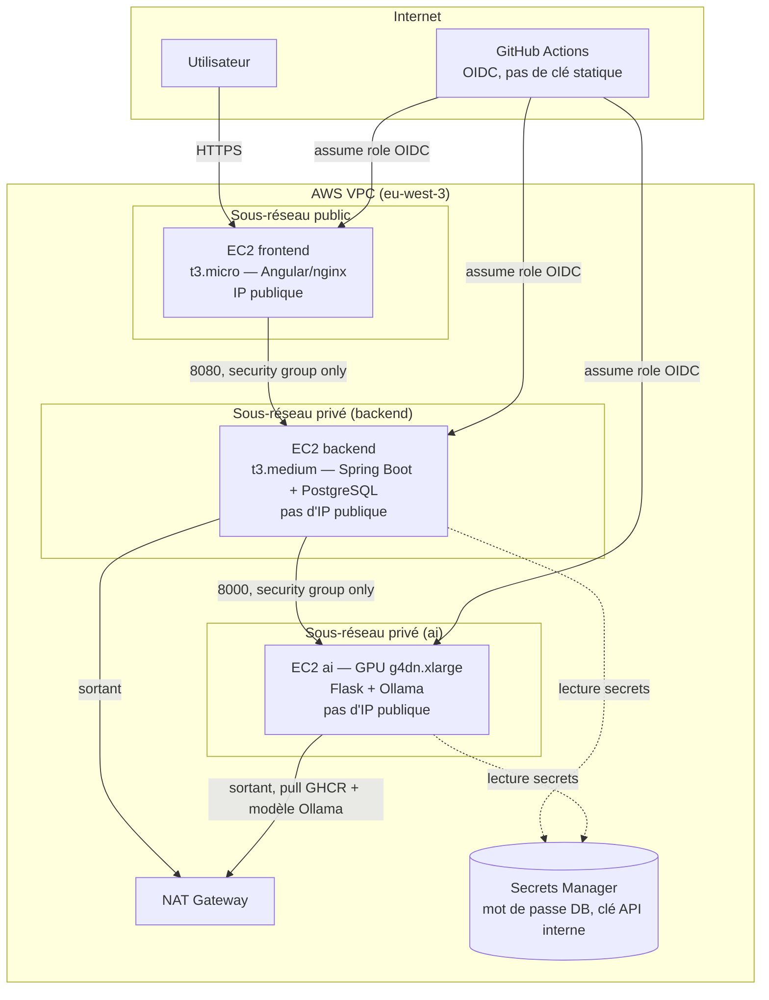

# Architecture

## Vue d'ensemble

Administration (Ansible) : tunnel **SSM Session Manager**, aucun port 22 ouvert dans aucun
security group, y compris pour le frontend. Voir `scripts/ssm-proxy.sh`.

## Pourquoi un dépôt séparé

`logiflow-infra` versionne l'infrastructure indépendamment du code applicatif
(`logiflow-backend`, `logiflow-ai-service`, futur `logiflow-frontend`) : un déploiement infra
n'implique pas de changement de code, et inversement. La CI de chaque dépôt applicatif publie une
image Docker sur GHCR ; Ansible, ici, ne fait que *pull* ces images — il ne build jamais rien sur
les instances cibles.

## Sécurité

| Mesure | Détail |
|---|---|
| Pas de SSH exposé | Aucun security group n'ouvre le port 22 vers Internet, y compris le frontend. Administration via AWS SSM Session Manager (`scripts/ssm-proxy.sh`), qui ne nécessite aucun trafic entrant. |
| Pas de clé IAM statique | Les instances s'authentifient à AWS via leur rôle IAM (instance profile), pas de `AWS_ACCESS_KEY_ID` à distribuer. La CI/CD s'authentifie via OIDC GitHub Actions (`terraform/bootstrap/github-oidc.tf`) — aucun secret AWS stocké dans GitHub. |
| Moindre privilège réseau | Chaque security group n'autorise que le trafic depuis le security group de son appelant légitime (frontend → backend → ai), jamais `0.0.0.0/0` sauf 80/443 sur le frontend. |
| Moindre privilège IAM | Chaque rôle EC2 ne peut lire que les secrets Secrets Manager qui le concernent (`terraform/modules/iam`). Le rôle OIDC de la CI est scopé aux types de ressources de ce projet, pas d'`AdministratorAccess`. |
| Sous-réseaux privés | backend et ai n'ont pas d'IP publique ; seule la sortie Internet (pull d'images, apt) passe par la NAT Gateway. |
| Secrets jamais dans git | Mot de passe DB et clé API interne sont générés aléatoirement par Terraform (`random_password`) et stockés dans AWS Secrets Manager ; Ansible les lit au moment du déploiement (`lookup('amazon.aws.secretsmanager_secret', ...)`) et les rend uniquement dans un `.env` local à chaque instance, jamais commité. |
| Chiffrement | Volumes EBS chiffrés (KMS géré AWS) sur les 3 instances ; bucket S3 du state Terraform chiffré + versionné. |
| IMDSv2 imposé | `http_tokens = "required"` sur les 3 instances (protection contre l'exfiltration de métadonnées via SSRF). |
| Durcissement OS | UFW (deny par défaut), fail2ban, mises à jour de sécurité automatiques, authentification SSH par clé uniquement, root login désactivé (`ansible/roles/hardening`). |
| Scan IaC en continu | `tfsec` sur chaque PR touchant `terraform/` (voir `.github/workflows/terraform-plan.yml`). |
| Apply jamais automatique | `terraform apply` est déclenché manuellement (`workflow_dispatch`) et protégé par un environnement GitHub nécessitant une approbation humaine — jamais de conséquence directe d'un `git push`. |

## CI/CD

- **`terraform-plan.yml`** (sur chaque PR touchant `terraform/`) : `fmt -check`, `validate`,
  `tflint`, scan de sécurité `tfsec`, puis `terraform plan` commenté directement sur la PR.
- **`terraform-apply.yml`** (déclenchement manuel uniquement) : `terraform apply`, protégé par
  l'environnement GitHub `production` (reviewer requis — à configurer dans *Settings >
  Environments*).
- **`ansible-lint.yml`** (sur chaque PR touchant `ansible/`) : `ansible-lint` + vérification
  syntaxique des playbooks.
- Côté `logiflow-backend` et `logiflow-ai-service` : la CI publie les images Docker sur GHCR
  uniquement sur push vers `main` (jamais depuis une PR).

## Déploiement (parallèle)

`ansible/playbooks/site.yml` exécute le socle commun (durcissement, Docker, monitoring) sur les 3
hôtes, puis un rôle par service. Ansible parallélise nativement l'exécution entre hôtes (`forks`
dans `ansible.cfg`) : aucune des 3 instances ne dépend du déploiement d'une autre, elles se
configurent simultanément.

## Estimation des coûts (eu-west-3, usage continu)

| Ressource | Gabarit | ≈ Coût mensuel |
|---|---|---|
| Instance ai (GPU, obligatoire pour Ollama) | g4dn.xlarge | ~400 $ (0,55 $/h × 730h) |
| Instance backend | t3.medium | ~30 $ |
| Instance frontend | t3.micro | ~7,5 $ |
| NAT Gateway | — | ~35 $ + trafic |
| EBS (30+60+20 Go gp3) | — | ~9 $ |
| Secrets Manager (2 secrets) | — | ~0,80 $ |

**Le poste dominant est de très loin l'instance GPU.** Pour maîtriser le budget : arrêter
l'instance `ai` (`aws ec2 stop-instances`) entre deux sessions de travail — le stockage EBS reste
facturé à l'arrêt, mais pas le calcul GPU. Aucune ressource de ce dépôt n'est provisionnée
automatiquement : `terraform apply` reste toujours une action manuelle et confirmée.

## Points à vérifier

- **Aucun IdP (Keycloak/OIDC) n'est provisionné** : le backend tourne en profil `local`
  (permissif, sans vérification JWT réelle) même sur cette infra cloud — voir
  `ansible/roles/backend/templates/env.j2`. Un lot ultérieur ajoutera Keycloak (probablement sur
  une 4e instance ou managé) et basculera vers le profil `dev`.
- **Pas de domaine ni de TLS** : le frontend répond en HTTP brut sur son IP publique. Ajouter un
  nom de domaine (Route 53) + certificat (ACM) + Load Balancer est le prochain incrément naturel,
  mais nécessite un nom de domaine que ce projet ne possède pas encore.
- **GHCR** : les images publiées par `logiflow-backend`/`logiflow-ai-service` doivent être
  rendues publiques (ou un token de pull ajouté dans `ansible/roles/*/tasks/main.yml`,
  `docker_login`) — à vérifier après le premier `git push` sur chacun de ces dépôts.
- **`environment: production`** doit être créé manuellement dans les paramètres GitHub du dépôt
  (*Settings > Environments*) avec au moins un reviewer requis, pour que la protection décrite
  dans `terraform-apply.yml` soit réellement appliquée.
- **Modèle Ollama** : `llama3.1` (8B) par défaut — à ajuster selon la VRAM disponible (16 Go sur
  T4) et la latence acceptable (voir `ansible/group_vars/role_ai.yml`).
